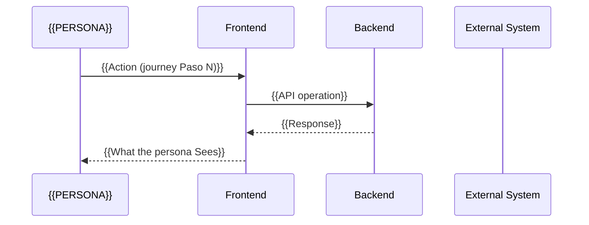

# Template B: Master `design.md` Template (Successful Output)

You must use this exact structure for the design file, ensuring section 0 contains the loop history.

> **Companion artefact.** Under `slicing_strategy: incremental` (default), the **increment-scoped delivery plan** lives in the sidecar `increment_plan.md` — which scenarios, which contract operations, which layer tasks ship in each increment. Design is holistic; slicing is sequential. Edit both when cross-layer types or contracts change.

```markdown
---
id: {{FEATURE_ID}}
status: DRAFT   # DRAFT | NEEDS_INFO | APPROVED | BLOCKED | REJECTED | INVALIDATED
scope: full-stack  # dual-axis — inherited from spec.feature.scope; full-stack | backend-only | frontend-only | integration
date: [DATE]
approver: PENDING
based_on_iteration: 1
based_on_schemas_version: 1
based_on_journey: false
consumes_contract: []  # inherited from spec.feature; upstream FEAT-XXX whose frozen contracts this design depends on

# Iteration model — push-based cascade fields
# Set by the upstream agent via CASCADE_PENDING_ITERATION when this artifact is stale.
# Cleared by this agent's --refine after a DELTA or FULL sync.
pending_iteration: null
pending_schemas_version: null
invalidated_sections: []
invalidated_by_iteration: null
invalidated_reason: null
cascade_source: null
cascade_timestamp: null
cascade_scope: []

# ITER-{FEAT}-{N} entries — see factory-iteration-model
iterations: []

# Designed-not-implemented carry-over (BLUEPRINT impl-state probe → IMPLEMENT delta tasks)
pending_design_items: []
---

<!-- Scope-aware section applicability:
     Sections tagged `applicable_when: scope in [...]` render only for matching scopes.
     When a section is N/A for the feature's scope, replace its body with: "N/A (scope={value})".
     Sections WITHOUT an `applicable_when` annotation apply to ALL scopes. -->


# Technical Design: {{FEATURE_ID}}

## 0. Technical Resolutions Log (Q&A Log)
> 📝 **Definition History:** Gaps detected and how they were resolved to reach this design.

- **Q1:** [Original question/gap, e.g., Which queue library to use?]
  - **A1:** [Final Decision, e.g., Use `BullMQ`]
  - **Rationale:** [Explanation, e.g., "RabbitMQ is overkill for this MVP and BullMQ is already in package.json"]

- **Q2:** ...

## 1. Diagrama de Arquitectura (C4)
> **Instruction:** Shows components and their interactions.
(Mermaid code generated following Standards rules)

## 1.1 Technical Sequence Diagram
> **Instruction:** The tiered sequence (Frontend / Backend / External System / Store) for the journey's paths. This is the TECHNICAL rendering of `user_journey.md § Section 2` — the journey itself stays business-pure (LAW-16); tiers, calls and payloads live HERE. One diagram per main path; label each interaction with the contract operation it maps to.



## 2. Constraints and Rules (Compliance)
*Alignment justification with ./context/rules*
- **Pattern:** (E.g., Repository Pattern used per rules/backend.md)
- **Security:** (E.g., Input validation in infrastructure layer)
- **Optional/Future Decisions (RDR mandatory):**
  - Use this section for any decision marked as "optional" or "future" (E2E, observability, performance, migrations, etc.)
  - If not applicable, write: "None"
  - **Strict RDR:** each decision must have **at least three options** and one **recommended**
  - Formato:
    | Item | Decision (Required/Deferred) | Rationale | Impact | Target Release |
    | :--- | :--- | :--- | :--- | :--- |
    | E2E tests | Required | Reduce regression risk | Higher confidence | v1 |

## 3. Implementation Inventory
| Action | File | Responsibility | Journey Schema Ref |
| :--- | :--- | :--- | :--- |
| CREATE | `src/domain/MyUseCase.ts` | Pure business logic | `LoginCredentials`, `AuthToken` |
| MODIFY | `src/infra/server.ts` | Register route in existing Router | — |

> **Journey Schema Ref:** For features co-created with `/CODESIGN`, reference the business concepts from `user_journey.md § Section 6: Business Fields` that each file consumes or produces. Technical fields (id, timestamps, audit) are free for ARCH. Business fields must match the journey (a new business field requires RDR → `CODESIGN --refine`, per LAW-16). For legacy features without `user_journey.md`, leave "—".

## 3.1 Cross-Layer Type Mapping (CODESIGN features)
<!-- applicable_when: scope in [full-stack] -->
> **MANDATORY** for `full-stack` features with `user_journey.md` (the Frontend column is required). **N/A** for `frontend-only` (no backend/DB columns), `backend-only` and `integration` (no Frontend column — replace this section with § 3.2 Wire-Format Mapping below). For legacy features without `user_journey.md`, omit this section.
> **Semantic Type is DERIVED by ARCH** from the plain-language `Meaning` + `Allowed values` columns of `user_journey.md § Section 6` (the journey carries NO types — LAW-16). Ambiguous derivations (e.g. "a positive money amount" → decimal precision) are RDR'd in Section 0.

### {{SchemaName}} (ej. LoginCredentials)
| Journey Field | Semantic Type | Frontend | Backend | DB | API (wire) |
| :--- | :--- | :--- | :--- | :--- | :--- |
| email | string (format: email) | `string` | `EmailStr` (Pydantic) | `VARCHAR(254)` | `string` (JSON) |
| password | string (min: 8) | `string` | `str` | N/A (hashed) | `string` (JSON) |
| remember_me | boolean (default: false) | `boolean` | `bool` | `BOOLEAN` | `boolean` (JSON) |

### {{SchemaName}} (ej. AuthToken)
| Journey Field | Semantic Type | Frontend | Backend | DB | API (wire) |
| :--- | :--- | :--- | :--- | :--- | :--- |
| access_token | string (JWT) | `string` | `str` (JWT) | N/A (stateless) | `string` (JSON) |
| refresh_token | string | `string` | `str` | `VARCHAR(512)` | `string` (JSON) |
| expires_in | integer (seconds) | `number` | `int` | `INT` | `number` (JSON) |

> **Rules:**
> - Each business field from the journey MUST appear in the table
> - If a layer does not apply (e.g., no DB for frontend-only schema), write "N/A"
> - If types are incompatible between layers (e.g., `number` JS vs `BIGINT` DB overflow), document WARNING in Section 0
> - REVIEW agent validates that the implementation matches these declared types

## 3.2 Wire-Format Mapping (backend-only / integration features)
<!-- applicable_when: scope in [backend-only, integration] -->
> **MANDATORY** for `backend-only` and `integration` features. Declares the wire-format (JSON / Protobuf / Avro / XML), header requirements, and on-disk representation for each business field in the integration contract. There is no Frontend column because no first-party UI consumes these schemas.

### {{SchemaName}} (ej. ProcessPaymentCommand)
| Journey Field | Semantic Type | Wire Format (JSON/Proto/Avro) | Backend | DB | Header / Metadata Requirement |
| :--- | :--- | :--- | :--- | :--- | :--- |
| idempotency_key | string (UUID) | `string` (JSON) / `string` (proto3) | `str` / `UUID` | `UUID` (PK on dedupe table) | also sent as HTTP header `Idempotency-Key` |
| amount | number (decimal(18,2)) | `string` (JSON, to avoid float rounding) / `sint64` minor-units (proto3) | `Decimal` / `Money` | `NUMERIC(18,2)` | — |
| currency | string (ISO 4217) | `string` (JSON) | `str` | `CHAR(3)` | — |

### {{SchemaName}} (ej. PaymentProcessedEvent)
| Journey Field | Semantic Type | Wire Format | Backend | DB / Store | Header / Metadata Requirement |
| :--- | :--- | :--- | :--- | :--- | :--- |
| idempotency_key | string (UUID) | `string` | `str` | referenced FK on dedupe table | propagated as `correlation_id` in trace |
| transaction_id | string (gateway-assigned) | `string` | `str` | `VARCHAR(64)` indexed | — |
| status | enum[SETTLED, DECLINED, PENDING] | `string` (JSON) / `enum` (proto3) | `PaymentStatus` (enum type) | `VARCHAR(16)` | — |

> **Rules (integration variant):**
> - Each business field from `user_journey.md § Section 6` MUST appear in the table.
> - Wire Format column documents the literal over-the-wire representation (and any divergence from native DB/language type).
> - Header / Metadata column flags fields that ALSO travel outside the payload (HTTP headers, message attributes, gRPC metadata, trace context).
> - Any lossy conversion (e.g. `decimal` → `float64`) MUST be documented as WARNING in Section 0 and have an ADR.
> - REVIEW agent validates that client/server serialisation honours this table exactly.

## 4. Decision History (ADR)
> Immutable record of architecture changes (Evolutionary).
> Each decision must have its corresponding file in `docs/adr/`.
- **[DATE - START]** Initial design generated based on Spec v1.
- **[DATE - REFINE]** Change: [DESCRIPTION] due to Feedback: [REASON]. (See docs/adr/ADR-001)

## 5. Infrastructure Needs
> Structured declaration of infrastructure resources required by this feature.
> Consumed by DEVOPS agent (`/DEVOPS --configure`) for IaC generation.
> BLUEPRINT (🏗️ ARCH hat) generates this section; DEVOPS formalizes into IaC.

### 5.1 Required Resources

```yaml
infrastructure_needs:
  resources: []
    # - id: "{RESOURCE_ID}"                  # Unique identifier (e.g., "users-db", "auth-cache", "event-bus")
    #   type: "database|cache|queue|storage|compute|function|cdn|api-gateway|search|other"
    #   purpose: "{WHY_NEEDED}"               # Business reason from spec/journey
    #   engine: "{SPECIFIC_ENGINE}"           # e.g., PostgreSQL, Redis, RabbitMQ, S3, AWS Lambda Node.js 20
    #   data_bearing: true|false              # true = requires backup, encryption, deletion protection
    #   feature_exclusive: true|false         # true = only this feature uses it; false = shared/system
    #   sizing_hint: "minimal|standard|high"  # Guidance for DEVOPS cost estimation
    #   environment_specific:                 # Optional: per-env overrides
    #     dev: { engine: "sqlite", sizing: "minimal" }
    #     prod: { engine: "PostgreSQL 16", sizing: "standard" }
    #
    #   ## Serverless-only fields (required when type: "function"):
    #   handler: "src/handlers/auth.handler"  # Entry point (file.exportedFunction)
    #   runtime: "nodejs20.x"                 # From constitution.md backend.runtime (cloud-native format). Override only if function needs different runtime.
    #   memory_mb: 256                        # Sized per feature workload: 128 (simple CRUD), 256 (standard), 512 (crypto/auth), 1024+ (ML/image)
    #   timeout_seconds: 30                   # Execution timeout (1-900)
    #   trigger: "api-gateway"                # Event source: api-gateway|queue|schedule|event-bus|storage|stream|direct
    #   contract_slug: "auth-oauth-login"     # CONTRACT_SLUG this function implements (when trigger=api-gateway)
    #   endpoints:                            # API paths this function handles (derived from OpenAPI contract)
    #     - "POST /api/v1/auth/login"
    #     - "POST /api/v1/auth/refresh"
```

### 5.2 External Integrations
> Resources already declared in `config/system_resources.json` that this feature depends on.
> DEVOPS ensures connectivity (network rules, firewall, service discovery) for these.

| Integration | system_resources.json ID | Required Environments | Notes |
|-------------|--------------------------|----------------------|-------|
| _none yet_ | | | |

### 5.3 Infrastructure Constraints
> Non-functional requirements that affect infrastructure decisions.

- **Availability:** {SLA requirement, e.g., 99.9%}
- **Latency:** {Max acceptable latency, e.g., <200ms p95}
- **Throughput:** {Expected RPS/messages per second}
- **Data Residency:** {Region constraints, e.g., EU-only}
- **Compliance:** {Relevant standards, e.g., SOC2, HIPAA}

## 6. Reliability Contract
<!-- applicable_when: scope in [backend-only, integration] -->
> **MANDATORY** for `backend-only` / `integration` features. The TECHNICAL formalisation of the business guarantees declared in `user_journey.md § Section 8: Third Parties & Guarantees` (LAW-16: the journey says "the customer is never charged twice"; this section says HOW). `test_plan.md § 2.2 Reliability Testing` is generated from this section. DEVOPS consumes it for infra alarms.

| Guarantee (journey § 8 ref) | Mechanism | Parameters |
| :--- | :--- | :--- |
| {{BUSINESS_GUARANTEE}} | Idempotency | key: {{FIELD}}, dedup window: {{WINDOW}}, storage: {{STORE}} |
| {{BUSINESS_GUARANTEE}} | Retry policy | none / exponential (base, max attempts, jitter) / dead-letter → {{DESTINATION}} |
| {{BUSINESS_GUARANTEE}} | Circuit breaker | threshold: {{N}} failures, half-open probe: {{INTERVAL}} |
| {{BUSINESS_GUARANTEE}} | Timeouts | per-hop: {{MS}} ms; graceful shutdown on SIGTERM/SIGINT |
| Observability | Metrics | latency_p95, error_rate, retry_count per operation |

## 7. Governance & Constraints Digest (GCD)
> Generated by `Factory-blueprint-design.instructions.md § Governance & Constraints Digest` — compact, pre-digested constraints for IMPLEMENT/REVIEW. Sub-sections 7.1 Architecture Constraints, 7.2 Governance Rules Index, 7.2b Shared Cross-Cutting Components, 7.3 SAST Patterns, 7.5 Contract-First Rules, 7.6 UX Constraints, 7.7 Coding Standards per the instruction.

### 7.4 Schema Constraints → REVIEW [SCHEMA]
> The MACHINE TYPING RECORD — sole downstream authority for business-field types/formats (REVIEW Check #5 BLOCKER, IMPLEMENT H-11, synthetic data). Derived from `user_journey.md § Section 6: Business Fields` (existence + meaning) + §§ 3.1/3.2 above (typing). Business fields LOCKED — deviation requires CODESIGN RDR.

```yaml
schemas_version: "{user_journey.schemas_version}"
entities:
  - name: "{{CONCEPT_NAME}}"
    locked_fields:
      - { field: "{{name}}", type: "{{type}}", format: "{{format}}", required: true }
    note: "Business fields LOCKED — deviation requires CODESIGN RDR"
exempt_technical_fields: [id, created_at, updated_at, deleted_at, version, audit_fields, correlation_id, trace_id]
type_format_registry:
  - { field_pattern: "*_id", format: "uuid", example: "550e8400-e29b-41d4-a716-446655440000" }
  - { field_pattern: "*email*", format: "email", example: "user@example.com" }
```
```
