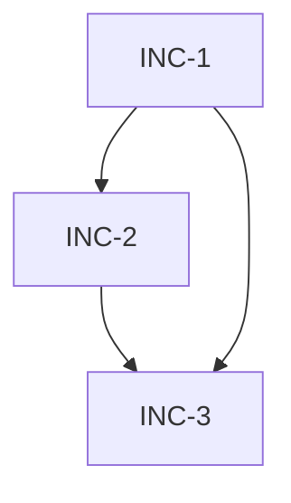

# Template: Increment Plan (`increment_plan.md`)

> Emitted by BLUEPRINT, consumed by IMPLEMENT `--plan`.
> Authoritative sidecar manifest of vertical increments. Each increment is a PR that leaves the product 100% functional and production-deployable on merge (strict — no feature-flag-OFF escape).
> **Placement:** `docs/spec/{{FEATURE_ID}}/increment_plan.md` (same folder as `design.md` and `test_plan.md`).

```markdown
---
id: {{FEATURE_ID}}
status: DRAFT   # DRAFT | PROPOSED | APPROVED | INVALIDATED
slicing_strategy: incremental   # incremental | monolithic — inherited from spec.feature.slicing_strategy
scope: {{SCOPE}}                # inherited from spec.feature.scope (full-stack | backend-only | frontend-only | integration)
last_update: [DATE]

# Iteration model tracking
based_on_iteration: 1
based_on_schemas_version: 1

# Push-based cascade fields — set by upstream --refine, cleared by IMPLEMENT --refine
pending_iteration: null
pending_schemas_version: null
invalidated_increments: []          # per-increment invalidation (list of increment IDs, e.g. ["INC-2", "INC-3"])
invalidated_by_iteration: null
invalidated_reason: null
cascade_source: null
cascade_timestamp: null

# Meta (set during RDR)
total_increments: 0                 # count of increments in § 1
rdr_rationale: ""                   # one-line justification for the chosen slicing
rdr_alternatives_considered: 0      # count of alternative slicings evaluated (RDR requires ≥3)
rdr_ratified_at: null               # ISO timestamp of user ratification
---

# Increment Plan: {{FEATURE_ID}}

**Base Spec:** `spec.feature`
**Base Architecture:** `design.md`
**Test Plan:** `test_plan.md`
**API Contracts:** `contracts/{{CONTRACT_TYPE}}/{{CONTRACT_SLUG}}/` (if applicable)

## 0. Slicing Rationale

- **Strategy:** `{{slicing_strategy}}`
- **Justification:** {{one-paragraph rationale; why this slicing over the alternatives presented at RDR}}
- **Rejected alternatives (summary):**
  - Alt-A: {{short description}} — rejected because {{reason}}
  - Alt-B: {{short description}} — rejected because {{reason}}
- **Ratified by user:** {{YYYY-MM-DD HH:MM}} — verbatim user choice recorded in feature worklog.

> When `slicing_strategy == monolithic`, § 1 contains a single increment `INC-1` covering the entire feature AND § 3 (Monolithic Escape Declaration) is populated with the heuristic that authorised monolithic.

## 1. Increments

> **Invariants:**
> - Every scenario in `spec.feature` is assigned to exactly one increment. No scenario is orphaned. No scenario is duplicated.
> - Every contract endpoint / message type produced by BLUEPRINT is assigned to exactly one increment.
> - `depends_on` forms a DAG (no cycles). INC-1 has `depends_on: []`.
> - `deployable: production` is MANDATORY. Feature-flag-OFF merges are NOT a valid escape.
> - Each increment, taken alone with its predecessors, constitutes a **100% functional product increment** — user-observable capability delivered end-to-end.

### INC-1 — {{increment-title}}

- **Scope:** {{one-line user-observable capability delivered by this increment}}
- **Scenarios covered:** `spec.feature` → [{{Scenario name 1}}, {{Scenario name 2}}]
- **Contract surface:** [{{POST /api/v1/foo}}, {{GET /api/v1/bar/:id}}] (or GraphQL fields / AsyncAPI topics / gRPC RPCs)
- **Depends on:** []   *(INC-1 always empty)*
- **Deployable:** production
- **Functional definition:** "After merging INC-1, the user can {{minimal end-to-end capability}}."
- **Acceptance (mergeable = 100% functional):**
  - [ ] All assigned scenarios pass E2E (if scope in [full-stack, frontend-only])
  - [ ] All assigned contracts pass API integration tests (if scope in [full-stack, backend-only, integration])
  - [ ] Reliability contract satisfied for assigned endpoints (if scope in [backend-only, integration])
  - [ ] CVP `increment_deployability` gate PASS
  - [ ] No TODO markers left in increment's code paths
- **Branch convention:** `feature/{{FEATURE_ID}}-inc-1-{{slug}}` (one PR per increment — see Factory-branching-strategy)
- **Layer tasks (filled by IMPLEMENT `--plan`):**
  - [A.1] …   *(backend / domain)*
  - [B.1] …   *(frontend)*
  - [C.1] …   *(integration / E2E)*

### INC-2 — {{increment-title}}

- **Scope:** …
- **Scenarios covered:** …
- **Contract surface:** …
- **Depends on:** [INC-1]
- **Deployable:** production
- **Functional definition:** "After merging INC-2 (on top of INC-1), the user can additionally {{next capability}}."
- **Acceptance:** (same checklist as INC-1)
- **Branch convention:** `feature/{{FEATURE_ID}}-inc-2-{{slug}}`
- **Layer tasks:** …

### INC-N …

## 2. Dependency Graph (DAG check)



> BLUEPRINT's CVP `increment_deployability` check verifies this graph is acyclic and every referenced increment exists.

## 3. Monolithic Escape Declaration

> Populate ONLY when `slicing_strategy == monolithic`. Delete this section for `incremental`.

- **Heuristic satisfied:**
  - Scenarios in `spec.feature`: `{{N}}` (≤ 2 required)
  - Contract endpoints/messages: `{{M}}` (≤ 3 required)
  - Scope: `{{scope}}` (must NOT be `full-stack`)
- **Confirmed by BLUEPRINT gate at:** `{{timestamp}}`
- **Justification:** feature below the slicing threshold — single PR is acceptable under the heuristic.
- **Override path:** to force `incremental` on a trivial feature, set `slicing_strategy: incremental` in `spec.feature` manually before `BLUEPRINT --start`.
```

---

## Frontmatter Field Reference

| Field | Type | Source | Notes |
|-------|------|--------|-------|
| `id` | string | `spec.feature.feature_id` | Same as feature id |
| `status` | enum | BLUEPRINT | `DRAFT` until `--approve`; `APPROVED` after CVP pass; `INVALIDATED` when iteration cascade invalidates ALL increments |
| `slicing_strategy` | enum | `spec.feature` | Inherited literally — never recomputed here |
| `scope` | enum | `spec.feature.scope` | Inherited |
| `based_on_iteration` | int | `spec.feature.iteration` | Snapshot at BLUEPRINT time |
| `pending_iteration` | int\|null | upstream `--refine` | Non-null signals cascade pending |
| `invalidated_increments` | list[string] | `CASCADE_INCREMENT_INTERNAL` | Subset of increment IDs requiring resync; empty when plan is fully aligned |
| `total_increments` | int | BLUEPRINT | Must equal count of `### INC-N` sections in § 1 |
| `rdr_alternatives_considered` | int | BLUEPRINT RDR | ≥ 3 per Factory-rdr |
| `rdr_ratified_at` | iso | BLUEPRINT RDR | Set when user ratifies choice |

## Invariants Enforced by CVP

1. **increment_deployability** (CRITICAL) — every increment has non-empty scenarios, `deployable: production`, acceptance checklist complete, DAG acyclic.
2. **increment_to_scenario_coverage** (CRITICAL) — every scenario in `spec.feature` appears in exactly one increment; no orphan, no duplicate.
3. **increment_to_contract_coverage** (CRITICAL) — every contract operation in `contracts/**` appears in exactly one increment.
4. **monolithic_heuristic** (CRITICAL when `slicing_strategy == monolithic`) — § 3 declaration present AND heuristic actually satisfied (≤2 scenarios AND ≤3 endpoints AND scope ≠ full-stack).

## Consumption Contract (IMPLEMENT `--plan`)

IMPLEMENT reads this file and generates `dev_plan.md` with one section per increment. Within each increment, tasks remain layered (Scaffolding / E2E / Unit / API / Reliability / Domain / Application / Infrastructure / Validation) — see `dev_plan_template.md`. Tasks are tagged `[INC-N.A.M]` / `[INC-N.B.M]` / `[INC-N.C.M]` (increment × layer × task-number). The existing `[A.M] / [B.M] / [C.M]` tags remain valid for `slicing_strategy: monolithic` (one implicit increment).

Each increment is implemented on its own branch `feature/{{FEATURE_ID}}-inc-N-{{slug}}` and merged as an independent PR before the next increment begins.
