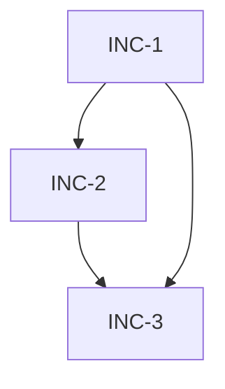

# Template: Increment Plan (`increment_plan.md`)

> Emitted by BLUEPRINT (contract-aware **refinement** of CODESIGN's authoritative `slice_map.md` value-slices — BLUEPRINT does NOT invent slices), consumed by IMPLEMENT `--plan`.
> Authoritative sidecar manifest of vertical increments. Each increment realizes one slice (`cascade_source: SLICE-{{FEATURE_ID}}-N`; 1:1 default) and is a PR that leaves the product 100% functional and production-deployable on merge (strict — no feature-flag-OFF escape).
> **Placement:** `docs/spec/{{FEATURE_ID}}/increment_plan.md` (same folder as `design.md` and `test_plan.md`).

```markdown
---
id: {{FEATURE_ID}}
status: DRAFT   # Plan-level: DRAFT | APPROVED | INVALIDATED (BLUEPRINT emits DRAFT → --approve flips to APPROVED → CASCADE_INCREMENT_INTERNAL may flip to INVALIDATED when every non-MERGED increment is invalidated). Per-increment status lives in § 1 with its own 5-value enum — see § Per-Increment Status Lifecycle below.
slicing_strategy: incremental   # incremental | monolithic — inherited from spec.feature.slicing_strategy
scope: {{SCOPE}}                # inherited from spec.feature.scope (full-stack | backend-only | frontend-only | integration)
last_update: [DATE]

# Iteration model tracking
based_on_iteration: 1
based_on_schemas_version: 1

# Push-based cascade fields — set by upstream --refine, cleared by IMPLEMENT --refine
pending_iteration: null
pending_schemas_version: null
invalidated_increments: []          # per-increment invalidation (list of increment IDs, e.g. ["INC-2", "INC-3"])
invalidated_by_iteration: null
invalidated_reason: null
cascade_source: null
cascade_timestamp: null

# Meta (set during RDR)
total_increments: 0                 # count of increments in § 1
rdr_rationale: ""                   # one-line justification for any intra-slice layering split
rdr_alternatives_considered: 0      # count of intra-slice layering alternatives (≥1 when a slice split; 0 when all 1:1)
rdr_ratified_at: null               # ISO timestamp of layering ratification (null when no slice split)

# ITER-{FEAT}-{N} entries — see factory-iteration-model
iterations: []
---

# Increment Plan: {{FEATURE_ID}}

**Base Spec:** `spec.feature`
**Base Architecture:** `design.md`
**Test Plan:** `test_plan.md`
**API Contracts:** `contracts/{{CONTRACT_TYPE}}/{{CONTRACT_SLUG}}/` (if applicable)

## 0. Refinement Record

> BLUEPRINT REFINES CODESIGN's authoritative capability-value slices (`slice_map.md`) into contract-aware increments — it does NOT invent or value-reorder slices. This section records the refinement, NOT a slice-invention rationale (that authority lives in `slice_map.md § 0 Decision History`).

- **Strategy:** `{{slicing_strategy}}`
- **Slice → increment mapping** (1:1 default; ≥2 only when an intra-slice layering RDR ran):
  - `SLICE-{{FEATURE_ID}}-1` → [{{INC-1}}]
  - `SLICE-{{FEATURE_ID}}-2` → [{{INC-2}}]
- **Intra-slice layering** (only when a slice split into ≥2 increments — the ONLY surviving RDR):
  - `SLICE-{{FEATURE_ID}}-N`: axis cited `reliability` | `balance-ceiling` | `cost-tiebreaker` *(per BLUEPRINT Recommendation Selection Rule, `Factory-blueprint-design.instructions.md` Step B)*; rejected layerings: {{summary}}; ratified by user {{YYYY-MM-DD HH:MM}} (verbatim choice in feature worklog).
- **Contract-forced deviations from CODESIGN value-order** (only when contracts cannot satisfy the declared order — never silent):
  - {{e.g., "SLICE-3 needs op X owned by SLICE-5 — realized after SLICE-5; flagged for CODESIGN --refine"}} — *(none if empty)*

> When `slicing_strategy == monolithic`, no slice_map exists; § 1 contains a single increment `INC-1` covering the entire feature AND § 2 (Monolithic Escape Declaration) is populated with the heuristic that authorised monolithic.

## 1. Increments

> **Invariants:**
> - Every scenario in `spec.feature` is assigned to exactly one increment. No scenario is orphaned. No scenario is duplicated.
> - Every contract endpoint / message type produced by BLUEPRINT is assigned to exactly one increment.
> - `depends_on` forms a DAG (no cycles). INC-1 has `depends_on: []`.
> - `deployable: production` is MANDATORY. Feature-flag-OFF merges are NOT a valid escape.
> - Each increment, taken alone with its predecessors, constitutes a **100% functional product increment** — user-observable capability delivered end-to-end.

### INC-1 — {{increment-title}}

- **Status:** DRAFT   *(DRAFT | READY | BUILDING | MERGED | INVALIDATED — governs immutability, see `immutability_policy.md § Per-Increment Immutability`)*
- **Scope:** {{one-line user-observable capability delivered by this increment}}
- **Scenarios covered:** `spec.feature` → [{{Scenario name 1}}, {{Scenario name 2}}]
- **Contract surface:** [{{POST /api/v1/foo}}, {{GET /api/v1/bar/:id}}] (or GraphQL fields / AsyncAPI topics / gRPC RPCs)
- **Depends on:** []   *(INC-1 always empty — intra-feature INC→INC DAG edge)*
- **cascade_source:** `SLICE-{{FEATURE_ID}}-1`   *(Rule 9 join key → the slice_map.md slice this increment realizes; CVP Check 18 resolves it)*
- **depends_on_slice:** []        *(inherited from the realized slice — intra-feature slice ordering; `[SLICE-{{FEATURE_ID}}-X]`)*
- **depends_on_feature:** []      *(inherited — cross-feature dep, `[FEAT-Y@SLICE-Y-Z]`)*
- **seam:** null                  *(inherited — `{ at: "<contract op / scenario / journey step>", resolves: "<SLICE-X | FEAT-Y@SLICE-Y-Z>" }` when a dep is declared; CVP Check 19)*
- **Deployable:** production
- **Functional definition:** "After merging INC-1, the user can {{minimal end-to-end capability}}."
- **Acceptance (mergeable = 100% functional):**
  - [ ] All assigned scenarios pass E2E (if scope in [full-stack, frontend-only])
  - [ ] All assigned contracts pass API integration tests (if scope in [full-stack, backend-only, integration])
  - [ ] Reliability contract satisfied for assigned endpoints (if scope in [backend-only, integration])
  - [ ] CVP `increment_deployability` gate PASS
  - [ ] No TODO markers left in increment's code paths
  - [ ] `qa_report_INC-N_*.md` status APPROVED (run `/qa --verify {{FEATURE_ID}} INC-N` after IMPLEMENT closes the slice)
- **Branch convention:** `feature/{{FEATURE_ID}}-inc-1-{{slug}}` (one PR per increment — see factory-branching-strategy)
- **Merged at:** null   *(ISO timestamp; set by the merge hook when the increment PR lands on main; trigger for status transition READY/BUILDING → MERGED)*
- **Pending iteration:** null   *(non-null when `CASCADE_INCREMENT_INTERNAL` detects upstream change affecting this increment and status is BUILDING — operator must `IMPLEMENT --pause` then `--refine` before status can transition further; cleared by `IMPLEMENT --refine`)*
- **Pending reason:** null   *(human-readable cascade trigger description, populated alongside `Pending iteration`)*
- **Layer tasks (filled by IMPLEMENT `--plan`):**
  - [A.1] …   *(backend / domain)*
  - [B.1] …   *(frontend)*
  - [C.1] …   *(integration / E2E)*

### INC-2 — {{increment-title}}

- **Status:** DRAFT
- **Scope:** …
- **Scenarios covered:** …
- **Contract surface:** …
- **Depends on:** [INC-1]
- **cascade_source:** `SLICE-{{FEATURE_ID}}-2`
- **depends_on_slice:** [SLICE-{{FEATURE_ID}}-1]   *(example — inherited from the realized slice)*
- **depends_on_feature:** []
- **seam:** { at: "{{contract op / scenario / journey step}}", resolves: "SLICE-{{FEATURE_ID}}-1" }
- **Deployable:** production
- **Functional definition:** "After merging INC-2 (on top of INC-1), the user can additionally {{next capability}}."
- **Acceptance:** (same checklist as INC-1)
- **Branch convention:** `feature/{{FEATURE_ID}}-inc-2-{{slug}}`
- **Merged at:** null
- **Pending iteration:** null
- **Pending reason:** null
- **Layer tasks:** …

### INC-N …

> **Canonical DAG.** The dependency graph is encoded by each increment's `depends_on:` field in § 1 above. CVP `increment_deployability` builds the graph from those fields and verifies acyclicity + that every referenced increment exists. § 3 below renders the same graph in Mermaid for human readers and is non-authoritative — if § 3 disagrees with § 1, § 1 wins.

## 2. Monolithic Escape Declaration

> Populate ONLY when `slicing_strategy == monolithic`. Delete this section for `incremental`.

- **Heuristic satisfied:**
  - Scenarios in `spec.feature`: `{{N}}` (≤ 2 required)
  - Contract operations: `{{M}}` (≤ 3 required)
  - Scope: `{{scope}}` (must NOT be `full-stack`)
- **Confirmed by BLUEPRINT gate at:** `{{timestamp}}`
- **Justification:** feature below the slicing threshold — single PR is acceptable under the heuristic.
- **Override path:** to force `incremental` on a trivial feature, set `slicing_strategy: incremental` in `spec.feature` manually before `BLUEPRINT --start`.
- **Frontend-only vacuous case.** Frontend-only features have `ops_count = 0` by construction (no backend API). A frontend-only feature with ≤2 scenarios therefore satisfies the heuristic trivially and may adopt `monolithic`. This is **intentional**: the vertical-slicing mandate primarily benefits features with backend contracts where per-endpoint rollout reduces risk. Teams that prefer strict vertical slicing for all UI features (training value, review discipline) should set `slicing_strategy: incremental` in spec.feature or bump the project default via `docs/setup.md`.

## 3. Human-readable Dependency Diagram (non-authoritative)

> **Non-authoritative.** Rendered from § 1 `depends_on:` for human visual review. CVP does NOT parse this block — the authoritative DAG lives in § 1. If this diagram disagrees with § 1, § 1 wins. BLUEPRINT regenerates this block mechanically on every emission of increment_plan.md.


```

---

## Frontmatter Field Reference

| Field | Type | Source | Notes |
|-------|------|--------|-------|
| `id` | string | `spec.feature.feature_id` | Same as feature id |
| `status` | enum | BLUEPRINT | `DRAFT` until `--approve`; `APPROVED` after CVP pass; `INVALIDATED` when iteration cascade invalidates ALL increments |
| `slicing_strategy` | enum | `spec.feature` | Inherited literally — never recomputed here |
| `scope` | enum | `spec.feature.scope` | Inherited |
| `based_on_iteration` | int | `spec.feature.iteration` | Snapshot at BLUEPRINT time |
| `pending_iteration` | int\|null | upstream `--refine` | Non-null signals cascade pending |
| `invalidated_increments` | list[string] | `CASCADE_INCREMENT_INTERNAL` | Subset of increment IDs requiring resync; empty when plan is fully aligned |
| `total_increments` | int | BLUEPRINT | Must equal count of `### INC-N` sections in § 1 |
| `rdr_alternatives_considered` | int | BLUEPRINT RDR | Count of **intra-slice layering** alternatives evaluated (≥1 when any slice split into ≥2 increments; 0 when every slice maps 1:1). NOT a slice-invention RDR — that authority is CODESIGN's `slice_map.md` |
| `rdr_ratified_at` | iso | BLUEPRINT RDR | Set when user ratifies choice |

## Per-Increment Status Lifecycle

Each `### INC-N` section carries its own `**Status:**` field, transitioned by the pipeline and read by `immutability_policy.md` to scope locks at increment granularity:

| Status | Transition trigger | Modifiable via `BLUEPRINT --refine` / `IMPLEMENT --refine` |
|---|---|---|
| `DRAFT` | Initial (on `BLUEPRINT --start`) | YES — scope, scenarios, contract surface, depends_on all editable |
| `READY` | `BLUEPRINT --approve` emits APPROVED increment_plan.md | YES — layer tasks editable; scope/scenarios/contracts FROZEN |
| `BUILDING` | `IMPLEMENT --plan` opens the increment branch | NO — complete or `--pause` first |
| `MERGED` | PR lands on `main` (merge hook updates `Merged at:`) | NO — requires `CODESIGN --revise` (new feature version) or a new follow-up increment |
| `INVALIDATED` | Iteration cascade (`CASCADE_INCREMENT_INTERNAL`) | YES — after resync; cleared when back to DRAFT/READY |

New increments MAY be appended to `increment_plan.md` after earlier increments reach `MERGED`, as long as the Iteration Model classifies the change as DELTA (additive, non-breaking). This is the mechanism for "follow-up increments" — e.g., retrofitting a flag-guarded rollout as its own increment without versioning the feature.

## Invariants Enforced by CVP

1. **increment_deployability** (CRITICAL) — every increment has non-empty scenarios, `deployable: production`, acceptance checklist complete, DAG acyclic.
2. **increment_to_scenario_coverage** (CRITICAL) — every scenario in `spec.feature` appears in exactly one increment; no orphan, no duplicate.
3. **increment_to_contract_coverage** (CRITICAL) — every contract operation in `contracts/**` appears in exactly one increment.
4. **monolithic_heuristic** (CRITICAL when `slicing_strategy == monolithic`) — § 3 declaration present AND heuristic actually satisfied (≤2 scenarios AND ≤3 contract operations AND scope ≠ full-stack).
5. **increment_status_monotonic** — status transitions follow the lifecycle above; no regression (e.g., `MERGED → BUILDING` is BLOCKED). **Delegated to `immutability_policy.check_increment_immutability`** — this is NOT a CVP function (CVP has none); the monotonicity guard lives in the immutability layer.

## Consumption Contract (IMPLEMENT `--plan`)

IMPLEMENT reads this file and generates `dev_plan.md` with one section per increment. Within each increment, tasks remain layered (Scaffolding / E2E / Unit / API / Reliability / Domain / Application / Infrastructure / Validation) — see `dev_plan_template.md`. Tasks are tagged `[INC-N.A.M]` / `[INC-N.B.M]` / `[INC-N.C.M]` (increment × layer × task-number). The existing `[A.M] / [B.M] / [C.M]` tags remain valid for `slicing_strategy: monolithic` (one implicit increment).

Each increment is implemented on its own branch `feature/{{FEATURE_ID}}-inc-N-{{slug}}` and merged as an independent PR before the next increment begins.
