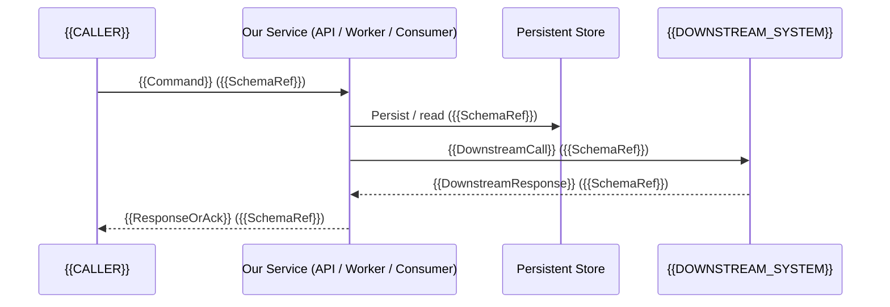

# Integration Journey: {{FEATURE_ID}} — {{FEATURE_NAME}}

> **Method:** Simplified Event Storming (Brandolini) — integration variant (no UI, no Read Models for display).
> **Generado por:** CODESIGN Agent | Feature: {{FEATURE_ID}} | Scope: backend-only / integration
> **Source of Truth for Data Schemas** — ARCH formalizes in contracts (OpenAPI / AsyncAPI / gRPC / Protobuf), DOES NOT invent business fields.
> **Incremental-slicing note.** Under `slicing_strategy: incremental` (the default), BLUEPRINT distributes the scenarios and caller actors across vertical increments declared in `increment_plan.md § 1` — each increment ships as an independent PR that leaves the integration surface 100% callable. Each increment's `contract_surface` lists the exact operations it delivers; consumers binding via `consumes_contract` see cumulative endpoints as increments merge.

---

## Section 0: Decision History

<!-- Chronological record of RDR decisions made during co-creation. UX hat is inactive for this scope — all decisions carry 🎩 PO. -->

| # | Date | Hat | Question | Options | Decision | Rationale |
|---|------|-----|----------|---------|----------|-----------|
| 1 | {{DATE}} | 🎩 PO | — | — | — | — |

---

## Section 1: Integration Overview

### Actors (caller-side + system-side)

| Actor | Type | Description |
|-------|------|-------------|
| {{CALLER_NAME}} | External caller / Upstream service / Cron / Webhook emitter | {{DESCRIPTION}} |
| {{SYSTEM_NAME}} | Our service | Processes the request |
| {{DOWNSTREAM_NAME}} | Downstream service / DB / Queue / External API | {{DESCRIPTION}} |

### Sequence Diagram (caller → system → downstream)



For async integrations, replace the final `-->>C` with an event publication (`API->>BROKER: publish EventX`) and document the consumer contract separately.

---

## Section 2: Integration Steps

<!-- Master table: each row is one step in the integration flow.
     Data In/Out reference schemas from Section 3 by name.
     "Trigger" identifies what initiates the step (HTTP request, event, cron, webhook).
     "Effect" is the persisted or observable outcome. -->

| # | Actor | Trigger | Action (Command) | Effect (Event / Side-effect) | Data In | Data Out | External System | Idempotency Key | Retry Policy |
|---|-------|---------|------------------|------------------------------|---------|----------|-----------------|-----------------|--------------|
| 1 | {{CALLER}} | {{TRIGGER}} | {{ACTION}} | {{EFFECT}} | {{SchemaRef}} | {{SchemaRef}} | — | {{IDEMP_KEY_FIELD}} | none / exponential / dead-letter |
| 2 | {{SYSTEM}} | {{TRIGGER}} | {{ACTION}} | {{EFFECT}} | {{SchemaRef}} | {{SchemaRef}} | {{DownstreamSystem}} | {{IDEMP_KEY_FIELD}} | exponential(max=5, base=2s) |

---

## Section 3: Data Schemas

<!-- SOURCE OF TRUTH for data. ARCH formalizes in OpenAPI/AsyncAPI/gRPC/Protobuf.
     Primitive types: string, number, boolean, date, uuid, enum[...], array[...], object
     Technical fields (id, created_at, updated_at, correlation_id, trace_id) are freely added by ARCH.
     Business fields are ONLY defined here. -->

### {{SchemaName}}
```yaml
# {{Description}}
field_name: type        # constraint or format hint
field_name: type        # constraint or format hint
```

<!-- Example (integration flavour):
### ProcessPaymentCommand
```yaml
# Inbound payment instruction
idempotency_key: string     # UUID, required, unique per logical operation
amount: number              # required, >0, decimal(18,2)
currency: string            # required, ISO 4217 (USD, EUR, ...)
customer_id: string         # required, references Customer aggregate
payment_method_token: string # required, tokenised — never raw card
metadata: object            # optional, free-form key/value, max 32 keys
```

### PaymentProcessedEvent
```yaml
# Outbound event after successful processing
idempotency_key: string
transaction_id: string      # issued by payment gateway
status: enum[SETTLED, DECLINED, PENDING]
settled_at: datetime        # ISO 8601, null when status != SETTLED
gateway_response_code: string
```
-->

---

## Section 4: Business Rules (Policies)

<!-- Business rules that condition behavior.
     Format: Condition → Action.
     Each rule is referenced in spec.feature as Given/When/Then. -->

| # | Rule ID | Condition | Action | Scenario Ref |
|---|---------|-----------|--------|--------------|
| P1 | {{RULE_ID}} | {{CONDITION}} | {{ACTION}} | {{SCENARIO_NAME}} |

---

## Section 5: External Systems (Integration Contracts)

<!-- External systems this feature integrates with. Every entry is consumed by BLUEPRINT --start to decide
     which contracts to freeze (OpenAPI / AsyncAPI / gRPC / Webhook contract). The contract_slug is assigned
     at BLUEPRINT --start and backfilled here. -->

| System | Direction | Protocol | Contract Type | Data Exchange (Schema Ref) | Auth Method | Contract Slug (backfilled) | Notes |
|--------|-----------|----------|---------------|----------------------------|-------------|----------------------------|-------|
| {{SYSTEM_NAME}} | Inbound / Outbound / Bidirectional | REST / GraphQL / gRPC / Event / Webhook | OpenAPI 3.1 / AsyncAPI 2.6 / Proto3 | {{SchemaRef}} | API Key / OAuth / mTLS / HMAC signature | {{CONTRACT_SLUG}} | {{NOTES}} |

---

## Section 6: Reliability Contract (integration-specific)

<!-- Explicit reliability guarantees for this flow. BLUEPRINT test_plan.md § Reliability Testing is generated from this section. -->

- **Idempotency:** {{keys + deduplication window + storage strategy}}
- **Retry policy (per downstream):** {{exponential / linear / none; max attempts; base delay; jitter}}
- **Circuit breaker:** {{enabled/disabled; threshold; half-open probe interval}}
- **Dead-letter handling:** {{destination; replay tooling; ownership}}
- **Timeouts:** {{per-hop timeout in ms}}
- **Graceful shutdown:** {{in-flight request drain window; signal handling: SIGTERM/SIGINT}}
- **Observability:** {{structured log fields, trace propagation header, critical metrics: latency_p95, error_rate, retry_count}}

---

## Traceability Matrix

<!-- Automatic mapping: Integration Step # → Gherkin Scenario → QA Test Case → Schema → Contract -->

| Step # | Gherkin Scenario | Schema In | Schema Out | Business Rules | Contract Slug |
|--------|------------------|-----------|-----------|----------------|---------------|
| #1 | {{SCENARIO_NAME}} | {{SchemaRef}} | {{SchemaRef}} | P1, P2 | {{CONTRACT_SLUG}} |
