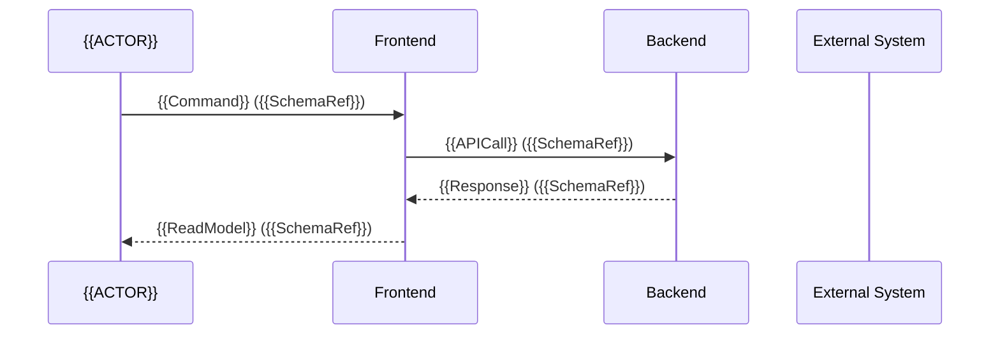

# User Journey: {{FEATURE_ID}} — {{FEATURE_NAME}}

> **Method:** Simplified Event Storming (Brandolini)
> **Generado por:** CODESIGN Agent | Feature: {{FEATURE_ID}}
> **Source of Truth for Data Schemas** — ARCH formalizes in contracts, DOES NOT invent business fields.
> **Incremental-slicing note.** Under `slicing_strategy: incremental` (the default), BLUEPRINT distributes the scenarios in `spec.feature` across vertical increments declared in `increment_plan.md § 1` — each increment ships as an independent PR that leaves the product 100% functional. This journey describes the COMPLETE end-state; per-increment UI/flow deltas are documented in `increment_plan.md` and in Section 0 below when they diverge significantly.

---

## Section 0: Decision History

<!-- Chronological record of RDR decisions made during co-creation -->

| # | Date | Hat | Question | Options | Decision | Rationale |
|---|-------|----------|----------|----------|----------|-----------|
| 1 | {{DATE}} | 🎩 PO | — | — | — | — |

---

## Section 1: Journey Overview

### Actors
<!-- Lista de actores que participan en esta feature -->

| Actor | Type | Description |
|-------|------|-------------|
| {{ACTOR_NAME}} | Usuario / Sistema / Externo | {{DESCRIPTION}} |

### Sequence Diagram



---

## Section 2: Journey Steps

<!-- Per-step blocks (parser-canonical format).
     Each step is delimited by a `### Paso N` heading followed by labeled fields.
     Downstream parsers (CODESIGN consumers, contract generators, test scaffolders)
     extract by anchoring on `^### Paso N$` and reading the labeled fields below.
     `DataIn:` / `DataOut:` reference schemas from Section 3 by name.
     `### Schema:` is OPTIONAL and used only when the step needs an inline schema
     reference distinct from Section 3 (rare). External System / Screen /
     QA-Test-Case correlations stay as labeled fields for parser stability.
     # correlates with QA test cases. -->

### Paso 1

- **Actor:** {{ACTOR}}
- **Action (Command):** {{ACTION}}
- **System Response (Event):** {{EVENT}}
- **External System:** —
- **Screen/View:** {{SCREEN}}
- **DataIn:** {{SchemaRef}}
- **DataOut:** {{SchemaRef}}

#### Schema:

> Optional inline schema reference. Most steps reuse a schema defined in Section 3 — leave this block empty or remove it when not needed.

```yaml
# Inline schema for this step only (rare). Use sparingly — Section 3 is the canonical schema source.
```

---

### Paso 2

- **Actor:** {{ACTOR}}
- **Action (Command):** {{ACTION}}
- **System Response (Event):** {{EVENT}}
- **External System:** —
- **Screen/View:** {{SCREEN}}
- **DataIn:** {{SchemaRef}}
- **DataOut:** {{SchemaRef}}

#### Schema:

```yaml
# Inline schema (optional, see note above).
```

---

## Section 3: Data Schemas

<!-- SOURCE OF TRUTH for data. ARCH formalizes in OpenAPI/TypeScript/GraphQL.
     Primitive types: string, number, boolean, date, uuid, enum[...], array[...], object
     Technical fields (id, created_at, updated_at) are freely added by ARCH.
     Business fields are ONLY defined here. -->

### {{SchemaName}}
```yaml
# {{Description}}
field_name: type        # constraint or format hint
field_name: type        # constraint or format hint
```

<!-- Ejemplo:
### LoginRequest
```yaml
# Data sent by the user to authenticate
email: string           # format: email, required
password: string        # minLength: 8, required
remember_me: boolean    # default: false
```

### LoginResponse
```yaml
# System response upon successful authentication
token: string           # JWT token
user_name: string       # display name
role: enum[admin, user, guest]
```

### LoginError
```yaml
# System response in case of authentication error
error_code: enum[INVALID_CREDENTIALS, ACCOUNT_LOCKED, ACCOUNT_NOT_VERIFIED]
message: string
remaining_attempts: number  # 0-5
```
-->

---

## Section 4: Business Rules (Policies)

<!-- Business rules that condition behavior.
     Format: Condition → Action.
     Each rule is referenced in spec.feature as Given/When/Then. -->

| # | Rule ID | Condition | Action | Scenario Ref |
|---|---------|-----------|--------|-------------|
| P1 | {{RULE_ID}} | {{CONDITION}} | {{ACTION}} | {{SCENARIO_NAME}} |

---

## Section 5: External Systems

<!-- External systems this feature interacts with.
     Each integration must be documented in config/system_resources.json -->

| System | Protocol | Data Exchange (Schema Ref) | Auth Method | Notes |
|--------|----------|---------------------------|-------------|-------|
| {{SYSTEM_NAME}} | REST / GraphQL / gRPC / Event | {{SchemaRef}} | API Key / OAuth / mTLS | {{NOTES}} |

---

## Traceability Matrix

<!-- Automatic mapping: Journey Step # → Gherkin Scenario → QA Test Case → Schema -->

| Journey Step | Gherkin Scenario | Schema In | Schema Out | Business Rules |
|-------------|-----------------|-----------|-----------|----------------|
| #1 | {{SCENARIO_NAME}} | {{SchemaRef}} | {{SchemaRef}} | P1, P2 |
