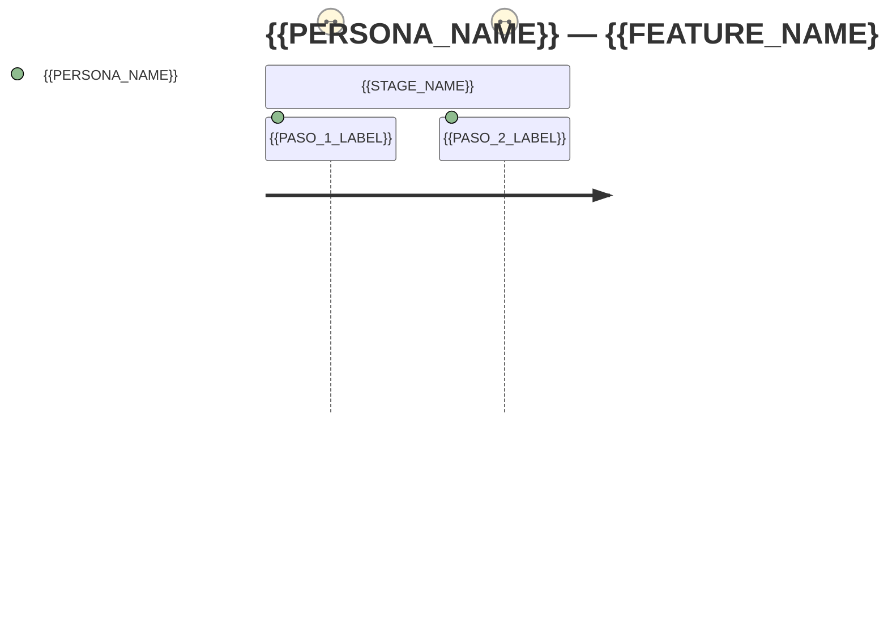

# User Journey: {{FEATURE_ID}} — {{FEATURE_NAME}}

> **LAW-16 Business Purity** — everything in this file is validatable by the PO/UX from business knowledge alone. NO technical types, tiers, protocols, or reliability mechanisms. Technical formalisation lives in `design.md` (BLUEPRINT).
> **Part I — Experience** (Sections 1-4): who travels, what they do, feel, and where it hurts. **Part II — Domain Contract** (Sections 5-8): what the business guarantees, in plain language.
> **Source of Truth** — Part II is the sole authority on WHICH business facts exist (fields, rules, states). ARCH formalizes types/formats in `design.md § 7.4`, NEVER invents business facts.
> **Machine anchors** — `### Paso N` headings, `**BDD Scenario:**` (exact scenario title in `spec.feature`), `**Mock Action:**` (`#step-N` id in `mock.html`, `—` for non-UI scopes). Validated by `scripts/check-journey-grammar.sh`.
> **Incremental-slicing note.** Under `slicing_strategy: incremental` (the default), scenarios group into capability-VALUE slices in `slice_map.md § 1`; slices may reference the named Paths below. This journey describes the COMPLETE end-state.

---

## Section 0: Decision History

<!-- Chronological record of RDR decisions made during co-creation -->

| # | Date | Concern | Question | Options | Decision | Rationale |
|---|-------|----------|----------|----------|----------|-----------|
| 1 | {{DATE}} | 🎩 PO | — | — | — | — |

---

<!-- ════════════ PART I — EXPERIENCE ════════════ -->

## Section 1: Personas

<!-- Every traveller through this feature. For backend-only/integration scopes the
     personas are business callers: a partner, an operator, a system acting on
     behalf of a business actor. "System" alone is not a persona — name WHO it acts for. -->

| Persona | Type | Knows | Wants | Context |
|---------|------|-------|-------|---------|
| {{PERSONA_NAME}} | Human / Business caller | {{WHAT_THEY_ALREADY_KNOW}} | {{WHAT_THEY_WANT}} | {{WHEN_WHERE_WHY_THEY_ARRIVE}} |

---

## Section 2: Journey Steps

<!-- One mermaid `journey` diagram per persona (scores 1-5 = the Feels value of each step),
     then per-step blocks. Parser-canonical: each step is delimited by `### Paso N`
     (global numbering across personas) followed by the labeled fields below — ALL
     nine fields mandatory, `—` allowed only where noted.
     `Feels` is comparable across features: 1 = frustration/abandonment risk,
     2 = notable friction, 3 = neutral, 4 = confidence, 5 = delight.
     `Pain` names the friction at this step (or `—`); `Ease` names what the design
     does to remove or soften it — this pair is the usability lens.
     `BDD Scenario` = exact `Scenario:` title in spec.feature (machine anchor).
     `Mock Action` = `#step-N` matching `<section class="imp-step" id="step-N">`
     in mock.html; `—` when scope has no mock. -->

```mermaid
journey
    title {{PERSONA_NAME}} — {{FEATURE_NAME}}
    section {{STAGE_NAME}}
      {{PASO_1_LABEL}}: {{FEELS_1}}: {{PERSONA_NAME}}
      {{PASO_2_LABEL}}: {{FEELS_2}}: {{PERSONA_NAME}}
```

### Paso 1

- **Persona:** {{PERSONA_NAME}}
- **Goal:** {{WHAT_THEY_TRY_TO_ACHIEVE_HERE}}
- **Does:** {{THE_ACTION_IN_BUSINESS_WORDS}}
- **Sees:** {{WHAT_THEY_OBSERVE_AS_RESULT}}
- **Feels:** {{N}}/5 — {{EXPECTED_EMOTION_AND_WHY}}
- **Pain:** {{FRICTION_AT_THIS_STEP_OR_DASH}}
- **Ease:** {{HOW_THE_DESIGN_SOFTENS_IT}}
- **BDD Scenario:** {{EXACT_SCENARIO_TITLE}}
- **Mock Action:** #step-1 <!-- backend-only/integration scopes use `—` -->

### Paso 2

- **Persona:** {{PERSONA_NAME}}
- **Goal:** {{GOAL}}
- **Does:** {{ACTION}}
- **Sees:** {{RESULT}}
- **Feels:** {{N}}/5 — {{EMOTION_AND_WHY}}
- **Pain:** —
- **Ease:** {{EASE}}
- **BDD Scenario:** {{EXACT_SCENARIO_TITLE}}
- **Mock Action:** #step-2

---

## Section 3: Paths

<!-- Named routes per persona — ordered Paso sequences. These COMPOSE the smoke
     blocks: each Path expands transitively Paso → BDD Scenario → test-plan TC
     (SMOKE-{N} = one Path). Every Paso referenced must exist in Section 2. -->

- **Path {{PATH_NAME}}** ({{PERSONA_NAME}}): Paso 1 → Paso 2
- **Path {{RECOVERY_PATH_NAME}}** ({{PERSONA_NAME}}): Paso 1 → Paso {{N}}

---

## Section 4: Pain & Emotion Map

<!-- The usability lens, aggregated: where it hurts, what we want them to feel,
     and why that emotion matters for the business at that point. -->

| Where (Paso) | Pain | Target emotion | Why here |
|--------------|------|----------------|----------|
| Paso {{N}} | {{PAIN}} | {{TARGET_EMOTION}} | {{WHY_IT_MATTERS}} |

---

<!-- ════════════ PART II — DOMAIN CONTRACT (conceptual, plain language) ════════════ -->

## Section 5: Actions & Outcomes

<!-- What the business commits to at each action. Plain language only. -->

| # | When the persona… (ref Paso) | The business guarantees… | Ref |
|---|------------------------------|--------------------------|-----|
| A1 | {{ACTION_IN_BUSINESS_WORDS}} (Paso {{N}}) | {{OBSERVABLE_BUSINESS_OUTCOME}} | Paso {{N}} |

---

## Section 6: Business Fields

<!-- SOLE authority on WHICH business fields exist. One table per business concept.
     Plain language: a non-technical reader validates every cell. NO types, NO
     formats, NO constraints syntax — ARCH derives those in design.md § 7.4
     (RDR back to CODESIGN --refine if a new business field is needed). -->

### {{CONCEPT_NAME}}

| Field | Meaning | Required | Allowed values (plain language) | Example |
|-------|---------|----------|--------------------------------|---------|
| {{FIELD_NAME}} | {{WHAT_IT_MEANS_TO_THE_BUSINESS}} | Yes / No | {{PLAIN_VALUES_OR_FREE}} | {{BUSINESS_EXAMPLE}} |

<!-- Example:
### Payment
| Field | Meaning | Required | Allowed values (plain language) | Example |
|-------|---------|----------|--------------------------------|---------|
| amount | How much the customer pays | Yes | A positive money amount | 49.90 euros |
| status | Where the payment stands | Yes | settled, declined, or pending | settled |
-->

---

## Section 7: Business Rules

<!-- Condition → Consequence, in business words. Each rule is exercised by at
     least one spec.feature scenario. -->

| # | Rule ID | When… | Then the business… | Scenario Ref |
|---|---------|-------|--------------------|--------------|
| P1 | {{RULE_ID}} | {{CONDITION}} | {{CONSEQUENCE}} | {{SCENARIO_NAME}} |

---

## Section 8: Third Parties & Guarantees

<!-- External parties in business terms (who they are, what is exchanged, what
     the relationship guarantees). For backend/integration scopes, reliability is
     expressed HERE as business guarantees ("the customer is never charged twice",
     "if it fails, X is notified") — the technical mechanisms (idempotency, retries,
     circuit breakers) are ARCH's job in design.md § 6 Reliability Contract. -->

| Party | What is exchanged | Business guarantee | Notes |
|-------|-------------------|--------------------|-------|
| {{PARTY_NAME}} | {{WHAT_FLOWS_IN_BUSINESS_WORDS}} | {{GUARANTEE}} | {{NOTES}} |

---

## Traceability Matrix

<!-- Mechanical join surface: Paso → scenario → mock → concepts → rules. -->

| Paso | Persona | BDD Scenario | Mock Action | Concepts | Rules |
|------|---------|--------------|-------------|----------|-------|
| 1 | {{PERSONA_NAME}} | {{SCENARIO_NAME}} | #step-1 | {{CONCEPT_NAME}} | P1 |
