<table>
<tr>
<td width="140" valign="middle"  align="center">

</td>
<td valign="top">

# Myrmion AI Factory for Claude

> **Phase 2 of the Myrmion ecosystem — the product-development framework.** Claude Code runs the complete Software Development Life Cycle under governance: slash commands that delegate each phase to its own agent, workers per surface, read-only critics and an external-facts reader — with the security and quality gates held by one reader (`scripts/gate.py`) at every control point.

</td>
</tr>
</table>

[](./LICENSE)
[](https://claude.ai/claude-code)
[](https://github.com/e2its/myrmion-framework)

## Part of the Myrmion ecosystem

[Myrmion](https://github.com/e2its/myrmion-framework) is an opensource ecosystem for adopting corporate AI with an organisation's own culture. It is made of three frameworks:

- **Myrmion Adoption** (phase 1) — the *enterprise framework*. Cultural modelling for companies adopting AI through commercial products: Regulatory Framework, Corporate Constitution, Departmental Layers. No programmatic agents.
- **Myrmion AI Factory** (phase 2) — the *product-development framework*. **This repository.** A governed agentic SDLC that builds software products under built-in governance, security, and quality gates.
- **Myrmion Federation** (phase 3) — the *federation framework*. Federated, culturally-aware governance for organisations whose departmental agents must invoke each other.

Adoption and Federation are complementary — the cultural-governance pair: one articulates the corporate culture, the other federates agents across departments. **The AI Factory is independent of both.** It is a self-contained framework for building software products and can be adopted on its own, with no Myrmion Adoption or Myrmion Federation in place.

📖 [Myrmion umbrella manifesto](https://github.com/e2its/myrmion-framework/blob/main/docs/manifesto.md) · [Myrmion Federation manifesto](https://github.com/e2its/myrmion-framework/blob/main/docs/federation/manifesto.md)

---

## Table of Contents

- [Part of the Myrmion ecosystem](#part-of-the-myrmion-ecosystem)

1. [Overview](#overview)
2. [Prerequisites](#prerequisites)
3. [Installation](#installation)
4. [Architecture](#architecture) — role agents, the roster, the one reader
5. [Workflow Sequence](#workflow-sequence-preset-full-sdlc)
6. [Command Reference](#command-reference)
7. [External CODESIGN Authoring (PO Package)](#external-codesign-authoring-po-package)
8. [Measuring the SDLC (measure subproduct)](#measuring-the-sdlc-measure-subproduct)
9. [Incremental Dev Plan (Vertical Slicing)](#incremental-dev-plan-vertical-slicing)
10. [Recommended Pipeline](#recommended-pipeline)
11. [Complete Workflow Diagram](#complete-workflow-diagram)
12. [Exception Routes and Recovery](#exception-routes-and-recovery)
13. [State Transition Matrices](#state-transition-matrices)
14. [State Glossary](#state-glossary)
15. [Dynamic Governance System](#dynamic-governance-system)
16. [Gates, Control Points and CI](#gates-control-points-and-ci)
17. [Memory Cache Architecture](#memory-cache-architecture)
18. [Immutability and Versioning](#immutability-and-versioning)
19. [Directory Structure](#directory-structure)
20. [Security](#security)
21. [Troubleshooting](#troubleshooting)
22. [License](#license)
23. [Support](#support)

---

## Overview

Myrmion AI Factory is **phase 2 of the Myrmion ecosystem — the product-development framework**: it transforms Claude Code into a **governed SDLC orchestrator** using slash commands (`.claude/commands/`). The main session delegates each phase by name to a **phase agent** with its own context — 6 SDLC phases plus 2 independent operational commands (AUDIT and BACKLOG) — and spawns the **workers** per surface, the **read-only critics** and the **external-facts reader** (15 definitions under `.claude/agents/`); cross-cutting skill protocols and contextual instruction files bind every one of them.

At setup the framework generates the project's **operational law** — `docs/constitution.md`, an index of project law (`[PLAW-NN]`) whose universal half is the `[LAW-NN]` index of `CLAUDE.md`: one sentence, one body, its records per law. Every agent, every gate, every generated artefact is validated against it, so governance is propagated into each agent move and the decision chain stays auditable.

### Key Features

- **Role agents and read-only critics (EVOL-049, EVOL-056)**: 8 commands invoked via `/command --args`; each phase runs in its own agent, work runs in workers per surface, the work is reviewed by critics that did not write it, and an external-facts reader reads the documentation before anyone plans. Writers and critics live on different model families by construction; a critic cannot write (the harness tool matrix); no agent ratifies, commits or decides.
- **Natural Language + Commands**: Say what you need or use explicit slash commands — Claude routes everything.
- **Constitution-Driven**: all decisions validated against the law index — `docs/constitution.md` (project law, generated at setup) and `CLAUDE.md § Governance Rules` (universal law); a sentence changes only through an accepted ADR, a body through a rule-file edit, both enforced by `scripts/check-adr-constitution-sync.sh`.
- **Contract-First Development**: API contracts (OpenAPI, GraphQL, gRPC, AsyncAPI, webhooks) defined and linted before implementation.
- **Build Verification Loop (BVL)**: tests executed in terminal, errors parsed and auto-fixed (max 3 attempts). One full verification loop per change — tests, lint, typecheck, build, format, SAST, complexity, seed alignment — once, on the bytes the commit carries, after the artefacts; sealed and honoured at the push (`gate.py seal`, EVOL-051); the static round and the governance digests before the critics. Test-case traceability (EVOL-053): every test states its case at one machine-readable home; `gate.py traceability` is red at the push for a case with no test, an unknown link or a baseline that must shrink.
- **Security by Design**: OWASP Top 10 + SAST/DAST built into workflow (inline, not post-facto).
- **TDD Enforcement**: Red-Green-Refactor-**Verify** cycle mandatory for all code (BVL closes the loop).
- **Immutable Specifications**: Version-controlled requirements with full audit trail.
- **Anti-Drift Protection**: protected paths and code blocks are never modified (`[LAW-02]`, `rules/protected-code.md`); one planning stage covers every governed write (EVOL-048); the branch rule is defended locally by the hooks and on the server per the project's SCM runbook (EVOL-054).
- **Project Tracking**: Integrated backlog management with external tools or local files.
- **Defect Prevention Catalog**: living catalog of runtime patterns invisible to static gates (the rule pair `defect-prevention.md` + `defect-prevention-cases.md`); delivered at the point of edit to every agent.
- **One reader for every gate**: `scripts/gate.py` with `scripts/gates/*.py` is the only place a gate's semantics live; hooks, workflows and the push preflight call it, never re-implement it (exit contract 0 ok · 1 red · 2 could not judge · 3 the reader itself missing).

---

## Prerequisites

| Requirement | Minimum Version | Notes |
|-------------|-----------------|-------|
| **Claude Code** | CLI, VS Code extension, JetBrains extension, or Desktop app | Any supported interface |
| **Claude model** | Two model families, chosen at SETUP (Q34) | A writer alias and a critic alias, never equal (`config/quality.json → agents.families`); the model is passed per spawn by `gate.py agents --resolve` |
| **Git** | 2.x | Initialized repository |
| **Bash-compatible shell** | — | Linux / macOS / WSL on Windows |
| **Python** | 3 | Framework scripts. The PO package tools need Python 3.10 or later with PyYAML (`python3 -m pip install pyyaml`) |

---

## Installation

The framework activates automatically when opening the repository with Claude Code. Claude reads `CLAUDE.md` from the root and registers slash commands from `.claude/commands/`.

```bash
# 1. Clone the repository
git clone https://github.com/e2its/myrmion-AI-factory.git
cd myrmion-AI-factory

# 2. Run Claude Code (CLI)
claude

# 3. Or open in VS Code / JetBrains with the Claude Code extension installed.
#    Claude Code auto-detects CLAUDE.md.
```

### Framework File Structure

```
CLAUDE.md                                    # Root governance (always loaded): the universal law index [LAW-NN], the gates, the control points
.claude/
├── commands/                                # 8 slash commands (one per SDLC phase + AUDIT + BACKLOG)
│   ├── audit.md  setup.md  codesign.md  blueprint.md  implement.md  devops.md  qa.md  backlog.md
├── agents/                                  # 15 role agents (EVOL-049, EVOL-056) — delegated by name, never by discovery
│   ├── factory-codesign.md  factory-blueprint.md  factory-implement.md  factory-devops.md  factory-qa.md   # phase agents (writer family)
│   ├── factory-dev-backend.md  factory-dev-frontend.md  factory-dev-platform.md  factory-dev-e2e.md      # workers per surface (writer family)
│   ├── factory-plan-critic.md                                                                             # the plan gate (critic family, read-only)
│   ├── factory-critic-correctness.md  factory-critic-governance.md  factory-critic-fidelity.md  factory-critic-security.md   # work critics by concern (read-only)
│   └── factory-docs-reader.md                                                                             # the external-facts reader — Beat 0 (read-only, documentation MCPs + web)
├── instructions/                            # 24 detailed instructions (contextual load per command)
│   ├── Factory-protocol-{smart-redirect,iop-intent-map,cwd-discipline}.instructions.md
│   ├── Factory-audit-{checklist,complexity}.instructions.md
│   ├── Factory-setup-{discovery,materialization,upgrade,reconcile-inventory}.instructions.md
│   ├── Factory-codesign-{vision,feature,sync}.instructions.md
│   ├── Factory-blueprint-{design,refine,validation}.instructions.md
│   ├── Factory-implement-{plan,build,review-checks}.instructions.md
│   ├── Factory-devops-{configure,provision-deploy}.instructions.md
│   ├── Factory-qa-verify.instructions.md
│   └── Factory-backlog-{operations,execution-plan,next-task}.instructions.md
├── skills/                                  # 23 cross-cutting skills (reusable protocols) — see § Cross-Cutting Skills
│   ├── factory-applicability-discovery/     # ADP — the governance Roll-Call, Step 0 of every command ([LAW-15])
│   ├── factory-governance-loading/          # GCRP — Zero Trust context recovery, the snapshot, the governance write protocol
│   ├── factory-rdr/                         # RDR — Recommendation → Decision → Ratification, two registers
│   ├── factory-adversarial-reasoning/       # FOR / AGAINST double pass with the do-less lens
│   ├── factory-code-review/                 # the agentic code-review engine ([LAW-13]) — the correctness critic's instrument
│   ├── factory-pr-review/                   # the seven-axis push gate (preflight before `git push`)
│   ├── factory-mcp-docs-scan/               # [LAW-10] the documentation-server allowlist: the banner's and the reader's
│   └── … (incremental-persistence, codebase-inventory, coherence-validation, build-verification, branching-strategy, commit-prompt,
│        batch-interactivity, agent-communication, iteration-model, worklog, memory-cache, preventive-sweep, backlog-next-task,
│        adr-management, complexity-check, po-intake)
├── hooks/                                   # 11 deterministic enforcement hooks, wired in settings.json
│   ├── check-branch-protection.sh           # PreToolUse Edit|Write — no write on a protected branch
│   ├── check-plan-approval.sh               # PreToolUse Edit|Write — no governed write without an approved plan (EVOL-048)
│   ├── check-plan-mode.sh                   # PreToolUse EnterPlanMode — a command that owns a planning phase never enters plan mode
│   ├── record-plan-approval.sh              # PostToolUse ExitPlanMode — the only writer of the plan-approval marker
│   ├── check-agent-spawn.sh                 # PreToolUse Agent — a roster agent spawns on its family's alias (EVOL-049)
│   ├── check-concurrency-lock.sh  check-governance-drift.sh  check-completion-gate.sh  check-ipp-compliance.sh
│   ├── deliver-governance.sh                # PreToolUse Edit|Write — the law governing the file being written, at the point of edit
│   └── check-push-preflight.sh              # PreToolUse Bash — the factory-pr-review push gate
└── settings.json                            # Hook wiring (SessionStart banner, prompt freshness, compaction reload, the PreToolUse gates)
.context/
├── templates/                               # Materialisation templates (SETUP --generate), by role: architect, codesign, develop, peer_review, po, qa, security, setup
│   └── setup/                               #   what a project inherits: claude/ (CLAUDE.md, agents, hooks), rules/, config/, scripts/, workflows/ (7 CI platforms),
│                                            #   scm/ (protection runbooks per platform), subproducts/ (po-package, measure), governance_versions.json (the manifest)
├── schemas/                                 # JSON schemas (workflow log, infrastructure registry)
├── assets/  utils/  locks/
config/                                      # coherence-context.json (audit + lock-step pairs), quality.json (every gate key: surface, planning, agents,
                                             #   documentation, verification, traceability, scm, complexity, code_review, security_scan, retired_terms, budgets)
scripts/
├── gate.py + gates/*.py                     # THE one reader of every gate (exit 0 ok · 1 red · 2 could not judge · 3 reader missing)
├── hooks/{pre-commit,pre-push,commit-msg}   # git hooks (scripts/install-hooks.sh): branch class + secrets at commit; the gate profile + the push gate at push
├── validate-governance.sh, check-lockstep-pairs.sh, check-adr-constitution-sync.sh, check-applicability-frontmatter.sh, …
├── materialize-synthetic.sh, test-*.sh      # the T2 suites CI runs (89-check synthetic materialisation among them)
└── factory-sync.sh, auto-tag.sh, security-scan.sh, generate-governance-snapshot.sh, governance-on{prompt,edit,compact}.sh
.github/workflows/                           # governance-check.yml (the gate profile at ci), lockstep-check.yml, auto-tag.yml
docs/project_log/evolutions/                 # ADR-EVOL-* (every framework evolution's record) and the release records
```

### Post-Installation Verification

1. Open Claude Code (CLI: `claude`, or via IDE extension).
2. Type `/` — the 8 framework commands should appear (audit, setup, codesign, blueprint, implement, devops, qa, backlog).
3. Type `/setup --init` to bootstrap a new project.
4. Claude reads `CLAUDE.md` automatically on every conversation (contains cross-cutting governance).

---

## Architecture

### Role agents, one per phase — spawned by name from the main session

```
                    ┌─────────────────────────┐
        User ───────►│  Claude Code (main      │◄─── CLAUDE.md (always loaded) · the hooks · gate.py
                    │  session: RDR, git, PR) │
                    └──────────┬──────────────┘
                               │ slash commands (/command --args) — each delegates its phase BY NAME
        ┌──────────┬───────────┼───────────┬────────────┬──────────┐
        ▼          ▼           ▼           ▼            ▼          ▼
   factory-    factory-    factory-    factory-     factory-   (audit, setup,
   codesign    blueprint   implement   devops       qa          backlog: main session)
        │          │           │           │
        │   plan critic     workers ↔ work critics + security lens   ← spawned by the MAIN SESSION, never by an agent
        │   (read-only)     (backend · frontend · platform · e2e)      (a phase agent carries no Agent tool)
        └──────────┴───────────┴───────────┘
              Beat 0: factory-docs-reader (read-only) reads the documentation before the design, the plan, the infrastructure
```

- **The main session orchestrates.** It runs every slash command, keeps the RDR, the user questions and every git operation (**no agent ratifies, commits or decides**), and spawns the agents by name — delegation is never by applicability discovery.
- **One agent per phase.** `/codesign`, `/blueprint`, `/implement`, `/devops`, `/qa` delegate to their phase agent (`.claude/agents/factory-<phase>.md`), which runs its instructions in its own context and writes its own surface. The IMPLEMENT build loop, the plan gate and the review passes run in the main session, which spawns the workers and the critics and hands the phase agent the results.
- **Workers per surface, critics by concern.** `factory-dev-{backend,frontend,platform,e2e}` write; `factory-plan-critic` gates a plan before it is approved (up to two rounds, then the user adjudicates); `factory-critic-{correctness,governance,fidelity,security}` review a completed diff they did not write (one round, then the user). Read-only is the harness tool matrix, not a sentence: a critic definition lists only `Read`, `Grep`, `Glob`, and the main session hashes the working tree before and after a critic run.
- **The external-facts reader.** `factory-docs-reader` (class `reader`, EVOL-056) reads the current official documentation of the libraries and services the work depends on — through the documentation servers `[LAW-10]` allowlists and the web — and returns a source per fact, the answer and the unknowns. Spawned at Beat 0, before the design (`Factory-blueprint-design`), the plan (`Factory-implement-plan`) and the infrastructure (`Factory-devops-configure`); a premise without a source is written `known-cold`, never assumed.
- **The class policy has one home.** `rules/agents.md` (`.context/templates/setup/rules/agents.md` here): tools per class, prompt budgets, families, per-spawn resolution, the fallback ladder, the round caps, the roster and the spawn sites. `python3 scripts/gate.py agents` validates it (a profile member and CI); `--resolve` computes the model and effort per spawn; `--digest` hands each agent the slice of law governing its surface; `--spawn` is the PreToolUse hook's question; `--check-return` refuses an incomplete return.
- **Two model families by construction.** `config/quality.json → agents.families` — a writer alias and a critic alias chosen at SETUP (Q34), never equal; the validator refuses equal aliases and the spawn hook refuses a roster agent spawned on the wrong family.

| Agent | Class | Family | Spawned by | Surface / concern |
|---|---|---|---|---|
| `factory-codesign` | phase | writer | `/codesign` | `spec.feature`, `user_journey.md`, `mock.html`, `slice_map.md` |
| `factory-blueprint` | phase | writer | `/blueprint` | `design.md`, `test_plan.md`, contracts, `increment_plan.md` |
| `factory-implement` | phase | writer | `/implement` | `dev_plan.md`, the increment bookkeeping |
| `factory-devops` | phase | writer | `/devops` | provisioning, the deployment the runtime surface decides, the sweep |
| `factory-qa` | phase | writer | `/qa` | the pre-verification gate, the smoke, the certification |
| `factory-dev-backend` · `-frontend` · `-platform` · `-e2e` | worker | writer | the build loop (main session) | `src/**` · `web/**, ui/**` · `scripts/**, infra/**, workflows, config/**` · `tests/**, e2e/**` |
| `factory-plan-critic` | plan-critic | critic | the plan gate (main session) | `increment_plan.md`, `design.md` before approval |
| `factory-critic-correctness` · `-governance` · `-fidelity` · `-security` | work-critic | critic | the review passes, the preventive sweep (main session) | logic and tests · laws, protected paths, the defect catalog · the diff against the spec and the plan · SAST, secrets, injection, authz |
| `factory-docs-reader` | reader | critic | Beat 0 of BLUEPRINT, IMPLEMENT --plan, DEVOPS --configure (main session) | the dependency manifests; documentation MCPs + web |

- Detailed instructions in `.claude/instructions/` are loaded contextually per command; skills in `.claude/skills/` are cross-cutting protocols every command and agent reuse; `CLAUDE.md` loads on EVERY conversation.

### How to Interact

Invoke commands directly as slash commands:

```
/codesign --start USR-001 "OAuth login"
/blueprint --start USR-001
/implement --build USR-001
```

Or use natural language — Claude identifies the intent and runs the appropriate command:

```
"I want to create an OAuth login feature"
→ Claude runs: /codesign --start {ID} "OAuth login"
```

### Persistence Loop

Commands **do not fail silently** — they pause and persist state:

1. Claude encounters ambiguity → saves the artifact with `status: NEEDS_INFO`.
2. Lists specific questions in the artifact's frontmatter.
3. Waits for user refinement → use `--refine` to answer.
4. Resumes execution from the saved checkpoint.

---

## Workflow Sequence (preset `full-sdlc`)

```
SETUP (one-time)
  → CODESIGN (PO↔UX, auto-approves 12/12)
  → BLUEPRINT (ARCH↔QA, --approve required)
  → CONTRACT-FREEZE          [hard gate — blocks IMPLEMENT --plan]
  → DEVOPS --configure
  → IMPLEMENT (workers ↔ work critics ↔ security lens + BVL)
  → PREVENTIVE-SWEEP         [hard gate — blocks DEVOPS --deploy dev]
  → QA (verify, auto-approves)
  → SMOKE-E2E                [hard gate — blocks QA --verify pass]
  → MERGE (PR → main)
  → DEVOPS (deploy prod)
```

Each `full-sdlc` feature expands into **8 backlog issues**. Three are hard gates:

- **CONTRACT-FREEZE** — freezes API contracts (OpenAPI, TS interfaces, GraphQL schema, etc., stack-specific) and the contract test harness before `IMPLEMENT --plan`.
- **PREVENTIVE-SWEEP** — runtime defect scan post-IMPLEMENT via a parallel scope-sized skill; zero open C-severity findings to pass.
- **SMOKE-E2E** — one smoke block per `user_journey.md § 3` Path, expanded transitively Paso → BDD Scenario → `test_plan.md` TC, executed on the dev-deployed build before `QA --verify` can pass.

Two additional gates operate at the epic/slice level:

- **SLICE-INTEGRATION-TEST** — closes each slice (≤3 features sharing a Bounded Context / Aggregate Root); blocks the start of the next slice.
- **EPIC-RETROSPECTIVE** — mandatory at epic close; blocks the start of the next epic. Includes write-back to the Defect Prevention Catalog (lessons → DC entries).

Presets `simplified` (3 issues: spec → implement → qa, no gates) and `single` (1 issue, no gates) are reserved for prototypes and spikes where gate overhead is not justified.

**AUDIT** is independent — runs at ANY time. It NEVER blocks the main workflow.

**BACKLOG** is independent — runs at ANY time after SETUP. It manages the project board, issues, and tracking.

> **Auto-Approval:** CODESIGN, DEVOPS `--configure`, and QA `--verify` auto-approve when all validations pass. `BLUEPRINT --approve` is the only mandatory manual checkpoint for the classic phases. Auto-approval does NOT bypass hard gates — each gate issue must be Done before the downstream command starts.

> **Gate Enforcement Modes:** each gate has a mode (`enforce` / `warn` / `off`) configured at SETUP. Greenfield projects start in `enforce` from day 1. Brownfield projects can start in `warn` and flip to `enforce` once the first new feature validates the gate artefact in main.

> **Dynamic Environments:** environments are read from `.claude/rules/ci-cd.md` `environments[]`. A project may have `dev → prod` or `dev → staging → UAT → prod`. The invariant: **MERGE always occurs BEFORE the production deploy**.

---

## Command Reference

> Invoke in Claude Code: `/command --args`, or describe the intent in natural language.

### Pre-0. AUDIT (Technical Due Diligence) — Optional

Role: Senior Technical Auditor. Evaluates the current state of an existing project before governance kicks in. Independent of the main workflow.

| Command | Arguments | Description |
| --- | --- | --- |
| `/audit --audit` | — | Full technical audit. Scan-First protocol. Master Checklist: Phase 0 (Language), Phase A (Governance / HR), Phase B (Architecture / Software), Phase C (Infrastructure), Phase D (Security). Atomic persistence: one section per turn. Resumable via `status: NEEDS_INFO`. |
| `/audit --software` | — | Software audit of an existing codebase (stack, architecture, complexity, tests, security) — `docs/software_audit.md`. |
| `/audit --software --deep` | — | Extended software audit: prior-audit reconciliation, stable finding ids `{AXIS}-{N}`, deep-dive protocol. |
| `/audit --refine {SECTION_ID}` | Section ID (P0, G1-G3, S1-S4, I1-I4, SEC1-SEC5, COMP1) | Refinement of a specific section. |
| `/audit --approve [--scope {audit\|software}]` | Optional scope | Audit closure with verdict `GO` / `NO_GO` / `GO_WITH_CONDITIONS`. |

Artifacts: `docs/technical_due.md`, `docs/software_audit.md`.

### 0. SETUP (Setup & Governance)

Role: Architect / Governance. Defines constitution, rules, and initial scaffolding.

| Command | Arguments | Description |
| --- | --- | --- |
| `/setup --init` | — | Discovery with AI budget + Brownfield auto-detection. Planning with 12 backend topologies and 10 frontend patterns. Execution with budget validation. |
| `/setup --generate` | — | Only with `phase: COMPLETED`. Materializes tripartite scaffolding (Backend / Frontend / Integration ACL). Includes IaC foundation scaffolding. Creates `MATERIALIZATION_REPORT.md` with a 60–80 task checklist. |
| `/setup --generate --resume` | — | Continues an interrupted materialization. Requires `MATERIALIZATION_REPORT.md`. Reads the checklist and resumes from the last pending task. |
| `/setup --migrate-legacy-setup` 🧪 | — | **EXPERIMENTAL.** Auto-migrates a legacy `setup.md` to the tripartite format. Requires a score > 85%. |
| `/setup --upgrade` | — | Upgrades governance artifacts to the latest framework version. 6 safety layers. Smart Additive Merge. |
| `/setup --rollback-upgrade {TIMESTAMP}` | Backup timestamp | Recovers the project from a failed upgrade. |
| `/setup --reconcile-inventory` | — | Reconciles `config/codebase_inventory.json` against the tree (the CIP inventory drift and freshness checks). |

Artifacts: `docs/setup.md`, `docs/constitution.md`, `.claude/rules/*`, `MATERIALIZATION_REPORT.md`.

### 1. CODESIGN (Co-Creation: PO ↔ UX)

Role: Phase agent `factory-codesign` — one context, both concerns (🎩 PO ↔ 🎨 UX). Co-creates the functional specification, the visual mockup, and the user journey.

| Command | Arguments | Description |
| --- | --- | --- |
| `/codesign --vision` | — | Generates the global UX vision. Mandatory for projects with a frontend. 7 phases. |
| `/codesign --vision-refine "[FEEDBACK]"` | Feedback | Refinement of the global vision. |
| `/codesign --vision-approve` | — | Joint PO+UX approval of the global vision. |
| `/codesign --vision-propagate` | — | Propagates vision changes to existing mocks. |
| `/codesign --start {ID}` | Feature ID | Starts co-creation. Vision Gate for UI features. Event Storming → spec ↔ mock ↔ journey until convergence. When `slicing_strategy: incremental`, also emits `slice_map.md` (capability-VALUE slices via the slicing-VALUE RDR, ≥3 alternatives). Auto-approves when all validations pass (incl. slice_map coverage). |
| `/codesign --refine {ID} "[FEEDBACK]"` | Feedback | Iterative refinement. Classifies changes as DELTA or BREAKING. Auto-approves when 12/12 validations pass. |
| `/codesign --sync {VISION\|ID}` | Target | **External authoring only.** Adopts ONE ratified Product Owner return verbatim — the design system or a feature — and adds only what the factory owns (gates, header, iteration ledger, change classification, cascade, auto-approval checks as validation). Never generates, never edits PO content: a finding returns the target as `NEEDS_INFO`. See [External CODESIGN Authoring](#external-codesign-authoring-po-package). |

Per-feature artifacts: `docs/spec/{ID}/spec.feature`, `mock.html`, `user_journey.md`.
Global vision artifacts: `docs/ux/vision/vision.md`, `app_shell.html`, `style_guide.html`, `page_templates.html`, `component_library.html`, `navigation_map.md`.
Design-system ↔ build alignment: `docs/ux/component-registry.json` (one entry per `data-component` anchor of the component library).

**Authoring surface (SETUP Q29, `docs/setup.md` `codesign.authoring`).** `internal` — co-created in the CLI with the commands above. `external` — authored by the PO in a Claude Desktop project; `--start`, `--refine` (and `--vision`, `--vision-refine` when the package covers the design system) are **guarded** and point to `--sync`. State commands (`--vision-approve`, `--vision-propagate`, `--revise`, `--cancel`, `--deprecate`, `--reset`) behave the same in both. An absent key means `internal`.

### 2. BLUEPRINT (Co-Design: ARCH ↔ QA)

Role: Phase agent `factory-blueprint` — one context, both concerns (🏗️ ARCH ↔ 🧪 QA); its plan is gated by `factory-plan-critic`. Co-designs architecture and test strategy simultaneously.

| Command | Arguments | Description |
| --- | --- | --- |
| `/blueprint --start {ID}` | — | Co-designs `design.md` + `test_plan.md` + `increment_plan.md`. Requires CODESIGN APPROVED + (when incremental) `slice_map.md` APPROVED. Produces C4, contracts, Section 5 (Infrastructure Needs). **Refines** CODESIGN's authoritative slices into increments (`cascade_source: SLICE-{FEAT}-N`, 1:1 default) — it does NOT invent or value-reorder slices; the only RDR here is intra-slice layering when a slice splits. |
| `/blueprint --refine {ID} "[FEEDBACK]"` | Feedback | Iterative refinement of design, tests and/or the Increment Plan. |
| `/blueprint --approve {ID}` | — | Joint ARCH+QA approval. Runs CVP Coherence Gate (CODESIGN_BLUEPRINT scope, incl. `increment_deployability`, `increment_to_scenario_coverage`, `increment_to_contract_coverage`, and the EVOL-036 slice checks `slice_map_presence` 0d / `slice_to_increment_coverage` 18 / `slice_seam_resolution` 19 / `slice_immutability_consistency` 20). Enables IMPLEMENT. |
| `/blueprint --adr {ID} "[TITLE]" "[DECISION]"` | Title and decision | Generates a standalone ADR. |
| `/blueprint --review-conflict {ID}` | — | Arbitration when the user routes an open work-round finding to the plan. |

Artifacts: `docs/spec/{ID}/design.md`, `test_plan.md`, `increment_plan.md`, contracts under `contracts/`.

### 3. IMPLEMENT (Implementation: workers ↔ work critics)

Role: Phase agent `factory-implement` — the plan and the increment bookkeeping. The **build loop runs in the main session**, which spawns the workers per surface, then the read-only work critics and the security lens (EVOL-049), and hands the phase agent the results. Before `--plan`, Beat 0: the external-facts reader (EVOL-056).

| Command | Arguments | Description |
| --- | --- | --- |
| `/implement --plan {ID}` | — | Generates the implementation checklist (`dev_plan.md`). Requires BLUEPRINT APPROVED. Under `slicing_strategy: incremental` emits one `## Increment INC-N` section per increment with `[INC-N.A.M]` / `[INC-N.B.M]` / `[INC-N.C.M]` tasks + `[INC-N.ACC.k]` acceptance gate; under `monolithic` preserves legacy `[A/B/C.N]` tags. |
| `/implement --refine {ID} "[FEEDBACK]"` | Feedback | Plan refinement. Standard Refine produces `[ADJ-N]` tasks; Delta Iteration produces `[D.N]` tasks. |
| `/implement --build {ID} [INC-N]` | Optional increment | Phased implementation: the worker (TDD + BVL) → the work critics → the security lens (SAST). Build Verification Loop: runs tests in terminal, parses errors, auto-corrects (max 3 attempts). One full verification loop (tests, lint, typecheck, build, format, SAST, complexity, seed alignment — once, after the artefacts and the status flip; sealed, honoured at the push — EVOL-051) — under `slicing_strategy: incremental` runs scope-filtered per slice before flipping `dev_plan.frontmatter.increments[INC-N].status: IMPLEMENTED_AND_VERIFIED`; the global `dev_plan.status` is **derived** and only flips after the last slice closure passes a plan-level BVL aggregate. Completion Gate: every task must be `[x]` or `@skip` with justification. |
| `/implement --fix {ID} "[HELP]"` | Help | Generates `[FIX-N]` tasks from QA rejection or blockers. Executes fix → marks `[x]`. |
| `/implement --finalize {ID}` | — | Closes the feature's implementation: the last increment's verification, the aggregate, the status flip. |

Artifacts: `docs/spec/{ID}/dev_plan.md`, source code, `peer_review_{ts}.md` (or `peer_review_{INC-N}_{ts}.md` per-slice when incremental), `sec_audit.md`, Draft PR.

### 4. DEVOPS (DevOps & Infrastructure)

Role: Phase agent `factory-devops` — infrastructure, CI/CD and environments; the deployment on a merge is decided by `gate.py runtime-surface --changed`. Before `--configure`, Beat 0: the external-facts reader on the services and IaC resources in scope (EVOL-056).

| Command | Arguments | Description |
| --- | --- | --- |
| `/devops --configure {ID}` | — | Generates the infrastructure plan (RDR-guided). Auto-approves when 7/7 checks pass. |
| `/devops --refine {ID} "{FEEDBACK}"` | Technical feedback | Adjusts the plan based on feedback. |
| `/devops --provision [{ID}] --env {ENV}` | Environment | Materializes infrastructure. With `{ID}` → feature-scoped. Without `{ID}` → env-scoped. |
| `/devops --deploy [{ID}] --env {ENV}` | Environment | Deploys code. Requires IMPLEMENT complete. Production requires MERGE + QA APPROVED. |
| `/devops --suspend [{ID}] --env {ENV}` | Environment | Suspends the environment to reduce cost. |
| `/devops --resume [{ID}] --env {ENV}` | Environment | Resumes a suspended environment. |
| `/devops --rollback [{ID}] --env {ENV}` | Environment | Rolls back a deployment. |
| `/devops --teardown [{ID}] --env {ENV}` | Environment | Destroys infrastructure. `data_bearing: true` requires a backup. |
| `/devops --status [{ID}]` | — | Status dashboard. |

Artifacts: `docs/spec/{ID}/devops_plan.md`, `infra/features/{ID}/` (IaC), `deployment_report_{ts}.md`.

**Execution Guardrails:**

- **G-1** Concurrency prevention | **G0** Governance load | **G0.5** Beat 0 — external facts (the reader, EVOL-056) | **G1** Stack coherence
- **G2** Cost limits (thresholds from the project config) | **G3** Secrets (hardcoding forbidden — BLOCKING) | **G4** Disaster recovery
- **G5** Environment names (from governance, never hardcoded — BLOCKING) | **G6** Downstream iteration detection | **G7** Placeholder detection
- Provision / deploy (`Factory-devops-provision-deploy`): production requires MERGE + QA APPROVED and the server-side branch protection (`gate.py scm-protection`, EVOL-054); `data_bearing: true` requires a backup before teardown.

### 5. QA (Quality Assurance — Post-Staging)

Role: Phase agent `factory-qa` — final post-code certification and verification in a deployed environment (includes DAST — the security pass); the certification reads the gates (`gate.py traceability`, the seal) rather than re-deriving them.

| Command | Arguments | Description |
| --- | --- | --- |
| `/qa --verify {ID} [{INC-N}]` | Optional `INC-N` | Checkbox-driven: generates the `[ ]` checklist (`[QA-PRE-*]` incl. `[QA-PRE-SCM]`, `[QA-GOV-*]`, `[QA-STATIC-*]`, `[QA-DC-*]`, `[QA-TC-*]`, `[QA-REL-*]`, `[QA-CVP-*]`, `[QA-REG-*]`, `[QA-DAST-*]`, plus `[QA-AGG-*]` in aggregate mode for incremental features), marks `[x]` as it executes. **Slice mode** (`INC-N` provided): verifies a single increment that has reached `IMPLEMENTED_AND_VERIFIED` per-entry — checklist filtered to scenarios assigned to the slice; required for incremental features before the aggregate. **Aggregate mode** (no `INC-N`): final feature-level verification; for incremental features requires every `qa_report_{INC-N}_*.md` already APPROVED. Auto-approves when ALL `[x]` AND verdict APPROVED. Requires a deployed environment. |
| `/qa --reject {ID} "[REASON]"` | Reason | Generates remediation items `[FIX-N]` → `/implement --fix`. |
| `/qa --e2e {ID}` | — | Runs E2E tests. |

Artifacts: `docs/spec/{ID}/qa/qa_report_{INC-N}_{ts}.md` (per-slice, slicing_strategy=incremental) and/or `docs/spec/{ID}/qa/qa_report_final_{ts}.md` (aggregate / sole report for monolithic). The aggregate report cross-references slice reports via the `aggregates:` frontmatter.

> **Note:** Test planning was absorbed by BLUEPRINT (the 🧪 QA concern of `factory-blueprint`). QA focuses on post-staging verification.

### 6. BACKLOG (Project Tracking & Issue Management) — Independent

Role: Project board operations manager. Creates issues, organizes the Kanban, and tracks features. Independent of the main workflow (like AUDIT).

| Command | Arguments | Description |
| --- | --- | --- |
| `/backlog --init-board` | — | Initializes the backlog. **External mode:** creates a project in the external tool + `project-config.json`. **Local mode:** creates `state.md` with the Kanban table. |
| `/backlog --plan-feature {ID} "{name}"` | Feature ID + name | Creates the issue set for a feature (phases configured during SETUP). External mode: via API. Local mode: entries in `state.md` + body files. |
| `/backlog --create-issue "{title}"` | Title | Creates a single custom issue. External mode: via API. Local mode: entry in `state.md` + body file. |
| `/backlog --move {ISSUE_NUMS} --to {STATUS}` | Issues + target column | Moves issues between Kanban columns. External mode: API. Local mode: updates `state.md`. |
| `/backlog --status` | — | Shows a board summary with issue counts per column. |
| `/backlog --plan-execution` | — | Analyzes feature dependencies, forms Epics by shared Bounded Context. **External mode:** projects the plan onto the board (milestones + labels + ordering). **Local mode:** writes `docs/backlog/execution-plan.md`. Cache at `/memories/repo/`. |
| `/backlog --update-execution {step}` | Completed step | Marks a step complete. **External mode:** advances the issue's status on the board. **Local mode:** updates the checklist in `execution-plan.md`. Refreshes the cache. |
| `/backlog --sync-execution` | — | Reconciles the plan with SSOT. **External mode:** rebuilds `project-board-cache.md` from `query_board`, reports drift without touching files. **Local mode:** reconciles `execution-plan.md` with `state.md`. |
| `/backlog --next-task` | — | **Push mode.** Returns the single next executable step (agent + command + evidence) chosen by the framework. Used by Smart Redirect post-command and automations. |
| `/backlog --eligible [--limit N]` | Optional cap | **Pull mode.** Returns the FULL set of items you could pick up right now (respecting intra-feature prereq + `blocked-by:#{N}` + gate mode). Default `--limit 20`; `--limit unlimited` to see everything. READ-ONLY (no writes, no persisted state). |

Prerequisite: `docs/setup.md` with a `project_tracking` section (configured during `/setup --init` Q27–Q27.6).

**SSOT mode:** if `project_tracking.tool != "None"` → external mode (the external board IS the plan — **`execution-plan.md` does NOT exist on disk**). If `project_tracking.tool == "None"` → local mode (`state.md` + `issue-bodies/` + `execution-plan.md` are the only sources of truth).

Artifacts (external mode): `docs/backlog/project-config.json` (non-sensitive connection identifiers and field mapping only — no issue registry, no tokens). Cache: `/memories/repo/project-board-cache.md`.
Artifacts (local mode): `docs/backlog/state.md`, `docs/backlog/issue-bodies/*.md`, `docs/backlog/execution-plan.md`. Cache: `/memories/repo/execution-plan-cache.md`.

---

## External CODESIGN Authoring (PO Package)

CODESIGN is the phase whose signing actor is not an engineer. When a project chooses **external authoring** (SETUP Q29), the Product Owner works in a **Claude Desktop project** — friendlier than a CLI — and the factory takes the result in without rewriting it.

```
  Factory                PO (Claude Desktop)            Factory
  build package  ─zip→   one feature, or the     ─zip→  validate · ratify · /codesign --sync · plan catalog
                         design system
```

| Step | Who | What |
|---|---|---|
| Build | `subproducts/po-package/build_po_package.py` | Reads the repo, writes OUTSIDE it. Product sheet, feature catalogue, **closed-vocabulary glossary**, route map, roadmap (exported through `/backlog`, never the tracker), the design system with one preview card per component, the feature annexes, the PO-safe templates, and the project instructions the PO pastes into Claude Desktop. |
| Author | PO | One feature per conversation, or the design system (six vision artefacts). Returns `MANIFEST.yaml` + `VISION/` and/or `{ID}/` with an **evolution request** (what changes and why, what was looked up before inventing a name or a component). |
| Validate | `validate_po_return.py` | **Form and coherence, never merit.** Journey form is delegated to `scripts/check-journey-grammar.sh` — the same gate CODESIGN applies to itself. Green means reviewable, never accepted. Red goes back unedited. `--selftest` first, always: the subproduct sits outside the governed surface and the self-test is its net. |
| Ratify | `factory-po-intake` | One RDR per change. Never in bulk. |
| Sync | `/codesign --sync {VISION\|ID}` | Adopts what was ratified **as written**. Adds the header, the iteration ledger, change classification and cascade. Runs the auto-approval checks as validation. Never regenerates, never repairs. |
| Catalog | `factory-po-intake` → `/backlog` | Every component `DESIGNED` in `docs/ux/component-registry.json` with no backlog reference becomes build work: a foundational **Component Catalog** feature with one sub-issue per component the first time, refinement issues afterwards. |

**Written instructions after materialisation.** `SETUP --generate` leaves `subproducts/po-package/RUNBOOK.md` (and `RUNBOOK.es.md`): the full operator procedure, self-sufficient before the skill arrives with `factory-sync.sh`. It carries all three design-system cases and a header SETUP resolves to name the one that applies; `MATERIALIZATION_REPORT.md` repeats it.

**Design system from code.** Tool-agnostic, like LAW-11: the process is the framework's, the tool is the project's (SETUP Q29.1 → `design_system.code_cards.dir` in `po-package.config.json`, plus `rebuild_command` when the tool has a terminal command). Usually the tool is a design-system-from-code skill the operator asks Claude to run (`code-manual`); a tool with a terminal command (`code-rebuild`) can also refresh the cards unattended. Card contract: each card is an HTML file whose first line is `<!-- @dsCard group="…" -->`; anything else is skipped out loud.

| Case | Cards come from | What runs |
|---|---|---|
| 6A | The vision only | Nothing extra |
| 6B | Code, per component; the vision for components not built yet | Ask Claude to run your tool, then build — or `build_po_package.py --rebuild` when a command is configured |
| 6C | Same as 6B, with a rebuild command | Also an **optional, advisory** GitHub Actions job (`design-system-rebuild.yml`) on push to main and on demand |

The rebuild command runs without a shell and with a timeout; a tool that is not installed, fails or times out falls back to vision cards with a loud warning and never blocks. `--check-drift` reports `code-card-unregistered`, `implemented-without-code-card` and `candidate-implemented` — the mechanical signal that the design system and what is built are still the same thing. Claude Design is a one-way mirror published by the user-started `/design-sync`; no gate depends on it.

**Language.** PO-facing prose ships in English with a Spanish override, selected by the project language at build time. Canonical section headings and field labels are never translated.

## Measuring the SDLC (measure subproduct)

The framework ships the instrument and the protocol; it never claims a measurement of itself (this repository delivers no product — no feature clock, no deployment, no review loop over a product diff). `SETUP --generate` materialises `subproducts/measure/`: a reader over **local data only** — Claude Code session transcripts, the git log, the worklog — reporting per window the share of active agent clock under gates, commits and review rounds per branch, rework, governance bytes emitted by hooks vs delivered to the model vs read by agents, per-agent model / tokens / bytes / citations, and the law and defect-class ids nobody cited (pruning candidates, decided by the user through RDR, never by a script). Nothing leaves the machine; a missing source degrades a section to `unavailable`, never fails the report.

**Before/after windows are the standard shape of a framework evolution**, executed in the adopting project: baseline before the change, the same report after `measurement.report_interval_days` (SETUP Q30), compared on the tracking item. Procedure: `subproducts/measure/RUNBOOK.md`. Self-test first, always: `python3 subproducts/measure/measure.py --selftest`.

## Incremental Dev Plan (Vertical Slicing)

Every feature ships as a sequence of **vertical increments**. Each increment is a single PR that leaves the product 100% functional and production-deployable on merge — no feature-flag-OFF escape, no half-done slices. This replaces the legacy "one big implementation branch per feature" model with a serial chain of small, mergeable, user-observable deliverables.

**Authoring (two stages).** CODESIGN owns **capability-VALUE** slicing: `CODESIGN --start` emits `docs/spec/{ID}/slice_map.md` via the slicing-value RDR (≥3 grouping alternatives — which scenarios form each shippable vertical and their user-value order — user ratifies verbatim). BLUEPRINT then **refines**: `BLUEPRINT --start` emits `docs/spec/{ID}/increment_plan.md` (sidecar to `design.md`), mapping each `SLICE-{FEAT}-N` to one contract-aware increment (1:1 default; ≥2 only via an intra-slice layering RDR). It does NOT invent or value-reorder slices. Each `### INC-N` declares: `scenarios_covered`, `contract_surface`, `depends_on` (DAG), `cascade_source: SLICE-{FEAT}-N`, `depends_on_slice` / `depends_on_feature` / `seam`, `deployable: production`, an acceptance checklist, and the branch name.

**Strategy frontmatter (`spec.feature`).** `slicing_strategy: incremental | monolithic`. Default `incremental`. `monolithic` is permitted ONLY when the **trivial-heuristic** passes: ≤2 scenarios AND ≤3 contract operations AND `scope` ≠ `full-stack`. BLUEPRINT blocks the escape otherwise.

**Consumption.** `IMPLEMENT --plan` reads the Increment Plan and emits `dev_plan.md` with one `## Increment INC-N` section per increment (topologically ordered by `depends_on`). Each section contains layered tasks tagged `[INC-N.A.M]` / `[INC-N.B.M]` / `[INC-N.C.M]` plus an `### Increment INC-N Acceptance Gate` with `[INC-N.ACC.k]` items.

**Branching.** One branch per increment — `feature/{FEATURE_ID}-inc-N-{slug}` — merged as an independent PR. Only one increment branch per feature is open at a time (existing concurrency lock). Branch open flips the increment's status `READY → BUILDING`; merge hook stamps `Merged at:` and flips `BUILDING → MERGED`.

**Trains and the surface ceiling (EVOL-045).** No reviewer receives a diff larger than the ceiling the project declared (`config/quality.json → surface.ceiling_files / ceiling_lines`, SETUP Q31). BLUEPRINT estimates every increment's surface and splits an over-ceiling increment into sub-increments — one PR each (`…-inc-N-{slug}-sub-M`) into the increment's branch, which becomes a **train**: protected, merges only, one closing PR to the base branch, one verification loop and one deployment per train. One diff base for every gate (`python3 scripts/gate.py diff-base`: a sub-increment measures against its train; an unrecognised branch name is red). The push measures the real surface (`gate.py surface`, files + lines, no exclusions) and blocks over the ceiling unless a commit trailer `Surface-Escape: <term>` names one of the closed `surface.escapes`.

**Enforcement.** CRITICAL CVP checks at `BLUEPRINT --approve` (and the local push preflight): `increment_deployability`, `increment_to_scenario_coverage`, `increment_to_contract_coverage`, `monolithic_heuristic`, plus the EVOL-036 slice checks `slice_map_presence` (0d), `slice_to_increment_coverage` (18), `slice_seam_resolution` (19), `slice_immutability_consistency` (20). Per-increment immutability (see `.claude/rules/immutability_policy.md § Per-Increment Immutability`) locks MERGED increments; per-slice immutability (§ Per-Slice Immutability) freezes a scenario wherever it sits once a realizing increment merges. Changes route through either `CODESIGN --revise` (new feature version) or a **Follow-up Increment / Follow-up Slice** (additive, non-overlapping — no version bump).

**Iteration cascade.** `CASCADE_INCREMENT_INTERNAL` (see `.claude/skills/factory-iteration-model/SKILL.md`) propagates upstream changes selectively: only increments whose `scenarios_covered` or `contract_surface` overlap with the change are flagged `INVALIDATED`. MERGED increments are never invalidated — they anchor production history; a follow-up increment carries the change forward.

---

## Recommended Pipeline

### Pre-0 (optional): Technical Due Diligence

```
/audit --audit       → Scan + sectioned audit
/audit --approve     → Verdict GO / NO_GO / GO_WITH_CONDITIONS
```

When AUDIT runs, SETUP auto-detects Brownfield and pre-fills data.

### Phase 0: Setup (Governance and Structure)

```
/setup --init        → Discovery → Planning → Execution (interactive)
/setup --generate    → Materializes scaffolding, constitution, rules
```

### Phase 0.1 (optional): Bootstrap Project Board and Backlog

```
/backlog --init-board                              → Creates the project on the configured tool (or local)
/backlog --plan-feature USR-001 "OAuth login"      → Feature issue set
/backlog --plan-feature USR-002 "Dashboard"        → Feature issue set
/backlog --plan-execution                          → Analyzes dependencies → generates execution plan by Epics
```

### Phase 0.5: Global Vision (mandatory for frontend projects)

```
/codesign --vision           → Generates the global visual identity
/codesign --vision-approve   → Approves the vision
```

With **external authoring** the PO creates the design system in Claude Desktop instead:

```
python3 subproducts/po-package/build_po_package.py            → Package for the PO (design-system project instructions included)
python3 subproducts/po-package/validate_po_return.py --zip …  → Form and coherence; then one RDR per change (factory-po-intake)
/codesign --sync VISION      → Adopts the ratified design system as written; refreshes docs/ux/component-registry.json
/codesign --vision-approve   → Approves the vision
(factory-po-intake)          → Plans the Component Catalog: one backlog issue per component no code materialises yet
```

### Phase 1: Definition and Co-Creation (Pre-Code)

```
/codesign --start USR-001 "OAuth login"     → Co-creates spec + mock + journey (auto-approves when 12/12 OK)
/codesign --sync USR-001                    → External authoring: adopts the PO's ratified journey + spec + mock as written (same checks, as validation)

/blueprint --start USR-001    → Co-designs design.md + test_plan.md
/blueprint --approve USR-001  → Enables IMPLEMENT (the only mandatory manual checkpoint)
```

### Phase 2: Implementation (Code)

```
/implement --plan USR-001          → Generates the checklist (dev_plan.md)
/implement --build USR-001         → TDD + BVL (real execution) + Review + SAST per phase
                                     Under slicing_strategy: incremental, run once per slice
                                     (one open INC-N branch at a time). BVL runs scope-filtered
                                     per slice; the plan-level aggregate runs on the last closure.
```

### Phase 2.5: Infrastructure (flexible — post-BLUEPRINT)

```
/devops --configure USR-001              → Infrastructure plan (auto-approves when 7/7 OK)
/devops --provision USR-001 --env dev    → Materializes infrastructure
```

### Phase 3: Certification (Post-Code)

```
/devops --deploy USR-001 --env staging   → Deploys to pre-production
/qa --verify USR-001 INC-1               → Per-slice verification (slicing_strategy=incremental)
                                           Repeat for each slice; required before the aggregate.
/qa --verify USR-001                     → Aggregate / final verification
                                           For monolithic features this is the only QA call.
```

### Phase 4: Merge and Production

```
git push origin feature/USR-001-login-oauth      → Push to remote
# Open PR → CI checks → approval → merge to main + tag

/devops --deploy USR-001 --env prod       → Deploy from main/tag
```

---

## Complete Workflow Diagram

```mermaid
graph TD
    Start([User: new feature]) --> TddCheck{Due Diligence?}
    TddCheck -->|Yes, optional| TddAudit["/audit --audit"]
    TddAudit --> TddNeedsInfo{status: NEEDS_INFO?}
    TddNeedsInfo -->|Yes| TddRefine["/audit --refine SECTION"]
    TddRefine --> TddAudit
    TddNeedsInfo -->|No| TddApprove["/audit --approve"]
    TddApprove --> TddVerdict{Verdict?}
    TddVerdict -->|GO / GO_WITH_CONDITIONS| Setup
    TddVerdict -->|NO_GO| NoGo([Project not viable])
    TddCheck -->|No| Setup{Setup complete?}

    Setup -->|No| SetupInit["/setup --init"]
    SetupInit --> SetupGen["/setup --generate"]
    SetupGen --> VisionCheck{Frontend?}
    Setup -->|Yes| VisionCheck

    VisionCheck -->|Yes| CodesignVision["/codesign --vision"]
    CodesignVision --> CodesignVisionApprove["/codesign --vision-approve"]
    CodesignVisionApprove --> CodesignStart["/codesign --start ID"]
    VisionCheck -->|No frontend| CodesignStart

    CodesignStart --> CodesignNeedsInfo{status: NEEDS_INFO?}
    CodesignNeedsInfo -->|Yes| CodesignRefine["/codesign --refine ID FEEDBACK"]
    CodesignRefine --> CodesignStart
    CodesignNeedsInfo -->|No| CodesignAutoApprove{12/12 validations?}
    CodesignAutoApprove -->|Yes, auto-approve 12/12| BlueprintStart["/blueprint --start ID"]
    CodesignAutoApprove -->|No| CodesignFix[Fix and re-refine]
    CodesignFix --> CodesignStart

    BlueprintStart --> BlueprintNeedsInfo{status: NEEDS_INFO?}
    BlueprintNeedsInfo -->|Yes| BlueprintRefine["/blueprint --refine ID FEEDBACK"]
    BlueprintRefine --> BlueprintStart
    BlueprintNeedsInfo -->|No| BlueprintApprove["/blueprint --approve ID"]

    BlueprintApprove --> ImplPlan["/implement --plan ID"]
    ImplPlan --> ImplNeedsInfo{status: NEEDS_INFO?}
    ImplNeedsInfo -->|Yes| ImplRefine["/implement --refine ID FEEDBACK"]
    ImplRefine --> ImplPlan
    ImplNeedsInfo -->|No| ImplBuild["/implement --build ID"]

    ImplBuild --> ImplBlocked{status: BLOCKED?}
    ImplBlocked -->|Yes| ImplFix["/implement --fix ID HELP"]
    ImplFix --> ImplBuild
    ImplBlocked -->|No| ImplDone{Build complete?}
    ImplDone -->|No| ImplBuild
    ImplDone -->|Yes| DevOpsDeploy["/devops --deploy ID --env PRE_PROD"]

    DevOpsDeploy --> QaVerify["/qa --verify ID"]
    QaVerify --> QaPass{Tests OK?}
    QaPass -->|No| QaReject["/qa --reject ID REASON"]
    QaReject --> ImplFix2["/implement --fix ID"]
    ImplFix2 --> ImplBuild
    QaPass -->|Yes, auto-approve| MergePR[MERGE: PR → main + tag]
    MergePR --> DeployProd["/devops --deploy ID --env PROD"]
    DeployProd --> End([Feature complete])

    classDef checkpoint fill:#2ecc71,stroke:#27ae60,stroke-width:3px,color:#fff
    classDef needsInfo fill:#f39c12,stroke:#e67e22,stroke-width:2px,color:#fff
    classDef blocked fill:#e74c3c,stroke:#c0392b,stroke-width:2px,color:#fff

    class BlueprintApprove,ImplDone checkpoint
    class CodesignNeedsInfo,BlueprintNeedsInfo,ImplNeedsInfo,TddNeedsInfo needsInfo
    class ImplBlocked,NoGo blocked
```



> The diagram shows the classic loop. The three hard gates (CONTRACT-FREEZE, PREVENTIVE-SWEEP, SMOKE-E2E) and the two epic/slice gates (SLICE-INTEGRATION-TEST, EPIC-RETROSPECTIVE) plug into the sequence as blocking backlog issues between the phases listed in [Workflow Sequence](#workflow-sequence-preset-full-sdlc). They do not appear inline here to keep the diagram focused on the classic phase loop.

---

## Exception Routes and Recovery

| Scenario | Persisted State | Recovery Command |
|----------|-----------------|------------------|
| AUDIT without evidence for a section | `technical_due.md → NEEDS_INFO` | `/audit --refine SECTION_ID "Data..."` |
| AUDIT verdict NO_GO | `technical_due.md → APPROVED, verdict: NO_GO` | Review findings with stakeholders |
| Ambiguous spec | `spec.feature → NEEDS_INFO` | `/codesign --refine ID "Clarifications..."` |
| Missing architecture mapping | `design.md → NEEDS_INFO` | `/blueprint --refine ID "Define APIs..."` |
| RED ZONE modification | `design.md → BLOCKED` | `/blueprint --refine ID "ADR: Justification..."` |
| Blocked implementation | `dev_plan.md → task BLOCKED` | `/implement --fix ID "Technical hint..."` |
| BVL exhausts its attempts (3) | task `FLAGGED` in `dev_plan.md` | Resilience Protocol (`Factory-implement-build`): retry, modify or escalate by RDR |
| SAST vulnerabilities | `sec_audit.md → VULNERABLE` | Inline fix loop in `/implement --build` |
| DAST vulnerabilities | `qa/qa_report_*.md → REJECTED` | Remediate → `/qa --verify ID [INC-N]` (slice or aggregate, depending on origin) |
| Hardcoded config | `qa/qa_report_*.md → REJECTED` | Fix → `/qa --verify ID [INC-N]` |
| Drift violation | `qa/qa_report_*.md → REJECTED` | `/blueprint --refine ID` or fix and re-run |

---

## State Transition Matrices

### `spec.feature` (CODESIGN)

| Current State | Valid Command | Next State |
|---------------|---------------|------------|
| — | `/codesign --start ID` | `DRAFT` or `NEEDS_INFO` |
| `NEEDS_INFO` | `/codesign --refine ID` | `DRAFT` or `NEEDS_INFO` |
| `DRAFT` | (auto-approve 12/12 OK) | `APPROVED` |
| `APPROVED` | `/codesign --refine ID` | `DRAFT` (new iteration) |

### `design.md` + `test_plan.md` (BLUEPRINT)

| Current State | Valid Command | Next State |
|---------------|---------------|------------|
| — | `/blueprint --start ID` | `DRAFT` or `NEEDS_INFO` |
| `NEEDS_INFO` | `/blueprint --refine ID` | `DRAFT` or `BLOCKED` |
| `DRAFT` | `/blueprint --approve ID` | `APPROVED` |
| `APPROVED` | `/blueprint --refine ID` | `DRAFT` (ADR required if RED ZONE) |

### `dev_plan.md` (IMPLEMENT)

| Current State | Valid Command | Next State |
|---------------|---------------|------------|
| — | `/implement --plan ID` | `DRAFT` or `NEEDS_INFO` |
| `NEEDS_INFO` | `/implement --refine ID` | `READY` |
| `READY` | `/implement --build ID` | `BUILDING` |
| `BUILDING` | `/implement --build ID` | `BUILDING` or `IMPLEMENTED_AND_VERIFIED` |
| `BUILDING` | (BVL exhausts 3 attempts) | `BUILDING` — the task is `FLAGGED`, the Resilience Protocol decides |
| `BUILDING` | `/implement --fix ID` | `BUILDING` |
| `IMPLEMENTED_AND_VERIFIED` | `/implement --refine ID` | `READY` (delta_mode) |
| `IMPLEMENTED_AND_VERIFIED` | `/implement --fix ID` | `BUILDING` (fix cycle) |

> Under `slicing_strategy: incremental` the plan-level state shown above is **derived**: it stays at `BUILDING` until every entry of `dev_plan.frontmatter.increments[]` has reached `IMPLEMENTED_AND_VERIFIED` AND a plan-level BVL aggregate passes. Per-slice transitions live on `increments[INC-N].status` and follow `READY → BUILDING → IMPLEMENTED_AND_VERIFIED → MERGED` (the merge is recorded by the SCM hook, not by IMPLEMENT).

### `qa/qa_report_{INC-N|final}_{ts}.md` (QA)

| Current State | Valid Command | Next State |
|---------------|---------------|------------|
| — | `/qa --verify ID` | `APPROVED` (auto) or `REJECTED` |
| `REJECTED` | `/implement --fix ID` completes | `INVALIDATED` |
| `INVALIDATED` | `/qa --verify ID` | `APPROVED` (auto) or `REJECTED` |
| `APPROVED` | — | Terminal (enables MERGE) |

### `technical_due.md` (AUDIT)

| Current State | Valid Command | Next State |
|---------------|---------------|------------|
| — | `/audit --audit` | `NEEDS_INFO` |
| `NEEDS_INFO` | `/audit --audit` | `NEEDS_INFO` or `DRAFT` |
| `DRAFT` | `/audit --approve` | `APPROVED` |
| `APPROVED` | `/audit --refine SECTION` | `DRAFT` (re-approval required) |

> `CANCELLED` is terminal across every artifact — it blocks any operation.

---

## State Glossary

### General artifact states

| State | Meaning |
| --- | --- |
| `DRAFT` | Complete draft, pending review or auto-approval. |
| `NEEDS_INFO` | Agent paused, requires `--refine` from the user. |
| `APPROVED` | Document frozen and validated. Enables the next phase. |
| `REJECTED` | (QA) Verification rejected. Requires `/implement --fix`. |
| `COMPLETED` | Process or phase finished successfully. |
| `BLOCKED` | Task not achievable without external help. |
| `CANCELLED` | Feature cancelled. Terminal state. |
| `DEPRECATED` | Feature superseded by a new version. Kept for audit trail. |
| `SUPERSEDED` | (ADR) Architectural decision superseded by a later ADR. |
| `CASCADE_PENDING_ITERATION` | Downstream artifact invalidated by an upstream change. Requires `--refine`. |

### IMPLEMENT states (`dev_plan.md`)

| State | Meaning |
| --- | --- |
| `READY` | Plan ready for `--build`. |
| `BUILDING` | Implementation in progress — TDD + Review + SAST per phase. |
| `IMPLEMENTED_AND_VERIFIED` | Code complete; enables DEVOPS deploy and QA verify. |
| `BLOCKED` / `REJECTED` / `INVALIDATED` | Not achievable without help / rejected by QA (→ `--fix`) / invalidated by an upstream iteration (→ `--refine`). |

> `VULNERABLE` is a `sec_audit.md` state (the security lens), not a plan state; `@skip` with a justification is a task marker, not a state.

### DEVOPS states (environments)

| State | Meaning |
| --- | --- |
| `NOT_PROVISIONED` | Environment defined but not provisioned yet. |
| `ACTIVE` | Environment provisioned and operating. |
| `SUSPENDED` | Environment paused. Requires `--resume`. |
| `DESTROYED` | Environment destroyed (`--teardown` complete). |

### QA states (reports)

| State | Meaning |
| --- | --- |
| `INVALIDATED` | Report invalidated by upstream changes. |

### CIP states (inventory artifacts)

| State | Meaning |
| --- | --- |
| `PLANNED` | Artifact registered in the inventory, not yet implemented. |
| `IMPLEMENTED` | Inventory artifact that already exists in code. |

### AUDIT states (due diligence)

| State | Meaning |
| --- | --- |
| `GO` | Positive verdict. Project viable. |
| `GO_WITH_CONDITIONS` | Viable with required conditions/mitigations. |
| `NO_GO` | Not viable. Unacceptable risks. |

---

## Dynamic Governance System

### Constitution index + rules manifest

`docs/constitution.md` is an index of project law: one `## [PLAW-NN]` entry per law — normative sentence, `Body:` pointer to the rule file (or skill / instruction) that hosts the full text, `Records:` ADR ids. One body per law, under the same heading + byte-identical sentence. Universal `[LAW-NN]` law lives in `CLAUDE.md` § Governance Rules.

- Rules manifest (what is loaded, per-rule `applicable_when`): `.context/governance_snapshot.md` — file-based cache, summarization-safe (see `.claude/skills/factory-governance-loading/SKILL.md`).
- Verification commands: the path-to-gate map `config/quality.json → verification.gates` (tests, coverage, lint, typecheck, build, format, SAST, complexity, seed alignment — those the stack has) and the seal (`verification.seal`), derived at SETUP (EVOL-051).

### Governance always-on enforcement (5-tier)

The governance snapshot covers the "what is loaded" question, but it is a passive artifact — it can go stale silently and it evaporates from context across compaction cycles. Five Claude Code hooks make governance demonstrably always-on in any session turn — and on the right channel: a PreToolUse hook blocks only with exit 2 + stderr, and reaches the model only through the `hookSpecificOutput.additionalContext` envelope (plain stdout from a pre-tool hook is never delivered; `scripts/test-hooks.sh` proves every shipped hook red and on channel):

| Tier | Trigger | Hook | What it does | Failure mode |
|------|---------|------|--------------|--------------|
| **1 — Visible** | `SessionStart` | `scripts/validate-governance.sh --banner` | Prints `Governance loaded: constitution {hash8}, setup {hash8} \| SDLC-first triage: ON` on session open. If the snapshot is missing, prints a remediation hint instead. | Non-blocking (informational). |
| **2 — Advisory** | `UserPromptSubmit` | `scripts/governance-onprompt.sh` → `validate-governance.sh --snapshot-freshness` | Per prompt: recomputes MD5 of `docs/constitution.md` + `docs/setup.md`, compares to the snapshot frontmatter. On drift, emits `<governance-warning reason="snapshot-stale">…</governance-warning>` on stdout — the agent regenerates inline (factory-governance-loading SKILL § Step 1 POST-LOAD) or runs `/setup --upgrade`. | Advisory only — never blocks the prompt. Carve-out: prompts starting with `/setup*` bypass the gate. Silent no-op when the project is not yet initialized. |
| **3 — Attribution** | `PostToolUse Edit\|Write` → `UserPromptSubmit` | `scripts/governance-onedit.sh` writes `.claude/state/governance-source-edited-{session_id}.marker` listing the changed paths; the next `scripts/governance-onprompt.sh` emits `<governance-source-edited paths="...">` with cause attribution + explicit regen instruction, then consumes the marker. Suppresses the tier-2 `<governance-warning>` for that prompt — the agent already knows why the snapshot is stale. | Marker write degrades silently when neither `jq` nor `python3` is available; tier 2 then fires its plain warning instead. |
| **4 — Resilient** | `PreCompact` → `UserPromptSubmit` | `scripts/governance-oncompact.sh` writes `.claude/state/governance-reload-{session_id}.marker`; the next `scripts/governance-onprompt.sh` emits the snapshot wrapped in `<governance-reload>...</governance-reload>` on stdout, which Claude Code appends to the next turn as additional context, then consumes the marker. | Post-compaction re-injection is lossy if `PreCompact` never fires (some IDE harnesses). Tiers 1 + 2 + 3 still operate. |
| **5 — At the point of edit** | `PreToolUse Edit\|Write` | `.claude/hooks/deliver-governance.sh` → `scripts/gate.py deliver`: the defect families, defect classes and rule pointers that govern **the file being written**, narrowed by the one applicability resolver, within `budgets.pre_edit`, through the PreToolUse envelope. A set already delivered in the session collapses to a one-line pointer. | Reader missing → silent pass. Never blocks. |

**Why 5 tiers (and not 1):** tier 1 makes governance visible so the user can spot when it fails to load. Tier 2 surfaces drift as an advisory the agent can act on without livelocking on the very session that produced it. Tier 3 attributes the cause when the staleness was self-inflicted (an EVOL/ADR edit) so the agent gets a richer instruction instead of a generic warning. Tier 4 survives summarization — without it, the snapshot would evaporate from the LLM's window after compaction even while the snapshot file on disk is still valid. Tier 5 delivers the law where it is applied: the snapshot carries the index and the families; the classes and rules that govern a file arrive when that file is written.

### Governance corpus in layers (EVOL-043)

Every rule has **exactly one body**. The constitution is the **index** (`## [PLAW-NN]` → one sentence, one `Body:` pointer, its records); `CLAUDE.md § Governance Rules` is the index of universal law (`[LAW-NN]`, same shape); bodies live once — in a rule file, a skill or an instruction — under a heading that quotes the sentence byte-identically. What a session receives is bounded and measured: `config/quality.json → budgets` holds one key per injection point (session start, prompt submit, pre-edit, snapshot, sentence and invariant lengths) and `python3 scripts/gate.py budget` measures the **real producer at its worst case** — not the file size — and fails on overflow or on a missing key. The defect catalog is **families** (surface globs + one-line invariant) and 7-column classes (family, invariant, gate, paths, agents, severity) with narratives in a cases annex read by id. Two-tier change ceremony: a sentence changes only through an accepted ADR in the same PR (`check-adr-constitution-sync.sh`, both directions); a body changes by rule-file edit + manifest bump. Three coherence gates (EVOL-044) run at every push and in CI: `gate.py laws --parity` (a body quotes its sentence byte-identically, one body per law), `gate.py currency` (a verdict artefact declares what it certified — `certifies: {subject, hash}` from `gate.py certify` — and goes STALE when the build moves under it), `gate.py manifest-parity` (a governed file's frontmatter version equals its manifest entry; the manifest is the source of truth). The per-PR surface ceiling (EVOL-045) is measured by `gate.py surface` against the one diff base (`gate.py diff-base`) at push and in CI. The deployment trigger (EVOL-047) is a positive list — `config/quality.json → surface.runtime_surface`, what a deployment can change; every deploying / release workflow (meta and the seven platform templates) asks `gate.py runtime-surface --changed` before its machinery and `gate.py runtime-surface` (parity, at push and in CI) holds the list to what the jobs and their scripts really read; the branch rule is untouched — every change ships via branch and pull request, documentation included. Role agents and read-only critics (EVOL-049): each phase runs in its own agent with its own surface, development workers per surface, and read-only critics that did not write the work — one data home for the class policy (`rules/agents.md`: tools per class enforced by the harness matrix, prompt budgets, model families as aliases with writers and critics on different families by construction, per-spawn model + effort, a fallback ladder that never degrades a writer, round caps), one reader (`gate.py agents`: validator in the gate profile and CI, per-spawn resolver, corpus digest, return-contract check), a bounded loop ending in the user's adjudication, the two review-time hats retired through the ratchet. One planning stage (EVOL-048): a write to a governed path on a branch class with no framework planning phase needs an approved plan — `gate.py plan` behind a pre-write hook, the marker written only by the harness's plan approval, documentation exempt except gate inputs, a command that owns a planning phase never entering plan mode, an advisory before the block. Gate profiles per control point (EVOL-046): one key `delivery_mode` in the governance manifest, one reader `gate.py profile` (fail-closed to production; light only for a sub-increment pushed to its train in development mode — and always for the static round before the critics (`--control-point static`) — full for everything else; the control points are the static round, the commit, the push, the train close, the pull request (CI — the only point that asks the server, `scm-protection`), the main branch and the deployment (`CLAUDE.md` § Pre-Action Gate; § Gates, Control Points and CI below).

**Marker scoping.** Both markers (`governance-reload-{session_id}.marker` and `governance-source-edited-{session_id}.marker`) live under `.claude/state/` — inside the Claude Code hook namespace, gitignored, and suffixed with the session ID passed in the hook stdin JSON. Two Claude sessions running against the same repo cannot collide on each other's replays.

**Smoke tests** (project-local):

1. Open a fresh session → the banner line is printed.
2. Edit `docs/constitution.md` from inside the agent without regenerating the snapshot → the next prompt receives `<governance-source-edited paths="docs/constitution.md">` with regen instruction (no plain warning). Edit it from outside the agent (manual `vi`) and the next prompt receives the plain `<governance-warning reason="snapshot-stale">` instead — both paths reach the agent, neither blocks.
3. Force a conversation long enough to trigger `PreCompact` → the following turn contains `<governance-reload>…</governance-reload>` with the full snapshot in context.

See [scripts/validate-governance.sh](scripts/validate-governance.sh), [scripts/governance-onprompt.sh](scripts/governance-onprompt.sh), [scripts/governance-onedit.sh](scripts/governance-onedit.sh), [scripts/governance-oncompact.sh](scripts/governance-oncompact.sh), and [.claude/settings.json](.claude/settings.json).

**Companion: IPP runtime binding.** The same PostToolUse → UserPromptSubmit marker pattern powers a parallel enforcement chain for the Incremental Persistence Protocol. `check-ipp-compliance.sh` (PreToolUse Write) drops `.claude/state/ipp-first-write-{session_id}.marker` after a legitimate skeleton write; `governance-onedit.sh` Block 2 (PostToolUse Edit\|Write) detects Pillar 2 violations (filled sections outpacing `_progress.completed_sections`) and drops `.claude/state/ipp-pillar2-{session_id}.marker`; `governance-onprompt.sh` Block 2b (UserPromptSubmit) emits `<ipp-reminder>` (teaching, post-skeleton) and `<ipp-warning reason="pillar-2-violation">` (corrective) tagged blocks on stdout, consuming the markers. The chain is independent of the five governance-source tiers and operates on artefact-integrity concerns. See [factory-incremental-persistence/SKILL.md § Runtime Binding](.claude/skills/factory-incremental-persistence/SKILL.md) for the canonical specification.

### Scope model — project scope + feature scope

The framework governs two orthogonal scope axes:

| Axis | Lives in | Set at | Drives |
|------|----------|--------|--------|
| **Project scope** | `docs/setup.md` `project_scope` field + governance snapshot | `/setup --init` (once per project) | Materialisation conditionals (frontend vs backend scaffolding, UX Constitution), discovery-question unlocks, CODESIGN `--vision` availability |
| **Feature scope** | `spec.feature` frontmatter `scope` field | `/codesign --start --scope=…` (per feature; defaults to project_scope) | Per-feature agent behaviour (Scope Compatibility Gate, Template Selector, Tripartite Alignment), auto-approval N/A paths, DC filtering, REVIEW check filtering, QA smoke template variant, DEVOPS target derivation, Preventive Sweep DC filter, backlog `scope:*` label + smoke-e2e-* phase variant |

**Enum:** `full-stack | backend-only | frontend-only | integration`. `integration` is the semantic alias of `backend-only` emphasising third-party adapters (webhooks, payment gateways, SaaS connectors, cron jobs, queue consumers).

**Compatibility matrix** (enforced at CODESIGN `--start` by the Scope Compatibility Gate):

| project_scope \ feature.scope | full-stack | backend-only | frontend-only | integration |
|---|---|---|---|---|
| `full-stack`    | ✅ | ✅ | ✅ | ✅ |
| `backend-only`  | ❌ | ✅ | ❌ | ✅ |
| `frontend-only` | ❌ | ❌ | ✅ | ❌ |
| `integration`   | ❌ | ✅ | ❌ | ✅ |

**Cross-feature contracts:** `spec.feature.consumes_contract: [FEAT-XXX]` declares upstream-frozen-contract dependencies. Enforced at three points — BLUEPRINT `--start` Consumes-Contract Resolution Gate, IMPLEMENT `--plan` Consumes-Contract Upstream Freeze Gate, and the Next-Task Resolver cross-feature filter. Iteration Model cascade (`ON_BLUEPRINT_CONTRACT_CHANGE` → `CASCADE_CONSUMERS`) re-opens every downstream consumer's CONTRACT-FREEZE when an upstream contract iterates.

#### Example — backend-only integration feature inside a full-stack project

```
# Setup (one-time, sets project_scope)
/setup --init
   # Q4.5: project_scope = full-stack  (project also has a UI for other features)

# Create a backend-only integration feature (e.g. Stripe webhook handler)
/codesign --start FEAT-039 --scope=backend-only
   # Scope Compatibility Gate: full-stack project accepts backend-only feature ✅
   # Template Selector:
   #   spec.feature             → gherkin_master_template.feature
   #   mock.html                → N/A (skipped; no UI)
   # Auto-approval: 12-check gate degrades to ~6 applicable checks (UX checks N/A)

/blueprint --start FEAT-039
   # Reads feature.scope=backend-only from spec.feature frontmatter
   # Produces: design.md (contract-first, § 3.2 Wire-Format Mapping replaces § 3.1 Cross-Layer Type Mapping)
   #           test_plan.md (includes § 2.2 Reliability Testing: REL-IDEMP, REL-RETRY, REL-TIMEOUT, REL-CB, REL-DLQ, REL-SHUTDOWN, REL-OBS)
   #           OpenAPI 3.1 webhook contract in contracts/webhooks/inbound/stripe/v1.yaml

/blueprint --approve FEAT-039
   # Part 1 ARCH elevates contract-completeness (backend-only has no UI surface to fall back on)
   # Part 2 QA: visual-consistency tests N/A; reliability tests BLOCKER if missing

# CONTRACT-FREEZE issue Done → IMPLEMENT gate unlocks

/backlog --plan-feature FEAT-039
   # Materialises 8 phase issues; suffix 8 gets phase:smoke-e2e-integration label (scope=backend-only → integration variant)
   # All 8 issues also get scope:backend-only label

/devops --configure FEAT-039
   # Scope-aware target derivation: function → serverless (Lambda); compute → worker
   # Reliability DCs consulted: idempotency, retry, DLQ, graceful shutdown all projected into devops_plan.md § Reliability Checks

/implement --plan FEAT-039
   # CONTRACT-FREEZE gate + Consumes-Contract Upstream Freeze Gate pass
   # dev_plan.md includes § Reliability Tests (7 RED-phase tasks)
   # REVIEW dispatcher filters UX checks to N/A; contract/DRY/security/reliability all active

/implement --build FEAT-039
   # REVIEW Check #7 [UX-*] reports "N/A — skipped under scope=backend-only" in peer_review § 3.7

# PREVENTIVE-SWEEP sub-agents filter DCs by scope → only backend + cross-cutting + infra scopes swept

/qa --verify FEAT-039
   # SMOKE-E2E gate: single smoke template, scope-aware execution mode (smoke_e2e_report_template.md)
   # SMOKE-REL-* blocks MANDATORY (for scope=integration); test_plan § 2.2 rows verified
   # Verification checklist includes QA-REL-1..7 reliability items
```

#### Example — frontend-only feature consuming the backend-only feature's frozen contract

```
/codesign --start FEAT-042 --scope=frontend-only
   # Scope Compatibility Gate: full-stack project accepts frontend-only feature ✅
   # The upstream dependency on FEAT-039 (the backend integration) is declared in spec.feature frontmatter: consumes_contract

/blueprint --start FEAT-042
   # Consumes-Contract Resolution Gate: verifies FEAT-039 design.md APPROVED + contracts/** non-empty ✅
   # Loads FEAT-039 frozen contract, surfaces read-only into design.md § 7 GCD
   # Produces UI components against the real endpoint shape — no invented fields

# If FEAT-039 contract changes later (upstream re-approval):
#   Iteration Model ON_BLUEPRINT_CONTRACT_CHANGE → CASCADE_CONSUMERS finds FEAT-042 in consumes_contract
#   → FEAT-042 design.md / test_plan.md / dev_plan.md marked CASCADE_PENDING_ITERATION
#   → FEAT-042 CONTRACT-FREEZE issue re-opened with stale-after-cascade label
#   → BLUEPRINT --refine FEAT-042 required before IMPLEMENT can continue
```

#### Example — backend-only PROJECT (no UI anywhere)

```
/setup --init
   # Q4.5 (Tier 0): project_scope = backend-only (answered, or auto-resolved from an APPROVED audit)
   # SETUP skips: the frontend discovery Q9-Q14, ux-constitution materialization, frontend rules, frontend directory scaffolding

/codesign --start FEAT-001
   # Scope Compatibility Gate: project_scope=backend-only rejects --scope=full-stack / --scope=frontend-only
   # Default feature.scope = backend-only (inherited from project)
   # --scope=integration also accepted (semantic alias)

# CODESIGN --vision is BLOCKED by the Scope Guard (backend-only projects have no UI surface)

# ... rest of lifecycle identical to the backend-only feature flow above (every feature gets phase:smoke-e2e-integration)
```

### SDLC-first triage (MANDATORY)

Complements governance always-on with a **behavioural** rule: every user request — slash command or free-form chat — must first be classified against the SDLC command catalogue. If the request maps to a command, the agent announces the routing in one line and executes the command instead of the raw action; if it does not map, the agent articulates in one line why it does not map before acting directly. Silence is a governance-scope violation.

The rule lives in two places depending on context (framework/project split):

- [.context/templates/setup/claude/CLAUDE.md § SDLC-First Triage](.context/templates/setup/claude/CLAUDE.md) — the materialized-project variant (SDLC-first is the default; carve-outs for read-only, docs-only change, trivial edits).
- [CLAUDE.md § Meta-Framework Triage](CLAUDE.md) — the framework-repo variant (meta-maintenance is the default; SDLC routing is the rare exception).
- [.claude/instructions/Factory-protocol-iop-intent-map.instructions.md](.claude/instructions/Factory-protocol-iop-intent-map.instructions.md) — the canonical technical classifier (IOP) that both variants point at.

### Cross-Cutting Skills (Protocols)

The framework ships 23 protocols reusable by every command and agent (`.claude/skills/`):

| Skill | Purpose |
|-------|---------|
| **Applicability Discovery (ADP)** `[LAW-15]` | Step 0 of every command: `python3 scripts/gate.py applicable …` — the Roll-Call of the laws, DCs, instructions and skills that apply, from the closed `applicable_when` vocabulary; a hand-written list is a violation. |
| **Governance Loading (GCRP)** `[LAW-01]` | Zero Trust context recovery, the governance snapshot, the Governance Write Protocol (manifest bump on every framework-core touch). |
| **RDR** | Recommendation → Decision → Ratification: ≥3 options, a justified recommendation, the user's verbatim choice, persisted at once — in two registers (plain language first, then technical; EVOL-050). |
| **Adversarial Reasoning** | The FOR / AGAINST double pass before any non-trivial choice (governance axis, product axis), with the always-on do-less lens (DC-29). |
| **Batch Interactivity (BIP)** | Tiered proposal → review → converge cycles instead of one-at-a-time Q&A. |
| **Incremental Persistence (IPP)** | Skeleton-first write, section-atomic saves, resume-on-entry. Survives context summarization. |
| **Codebase Inventory (CIP)** `[LAW-03]` | Cross-command DRY inventory; the CIP Canary gate prevents duplication post-summarization. |
| **Coherence Validation (CVP)** | Cross-artifact traceability and completeness validation before a downstream phase consumes an artefact. |
| **Build Verification Loop (BVL)** `[LAW-05]` | Real test execution, error parsing, auto-fix (max 3 attempts); one full verification loop per change (8 members), sealed and honoured at the push. |
| **Complexity Check** `[LAW-11]` | Cyclomatic complexity through a project-configured tool, thresholds as keys, fail-open on infrastructure faults (DC-28). |
| **Code Review** `[LAW-13]` | The agentic code-review engine (six vendored lenses run by `factory-critic-correctness`); per increment and as the push gate, proven by a content-hash marker. |
| **PR Review (push gate)** | Seven axes (code, code↔docs, contracts, ADR, traceability, complexity, agentic review) as a preflight before `git push` and an assistive reviewer of an open PR. |
| **Preventive Sweep** | Pre-deploy runtime defect scan by parallel read-only critics (`factory-critic-governance`), one per non-overlapping scope of the defect catalog. |
| **MCP Docs Scan** `[LAW-10]` | The documentation-server allowlist: the banner design and build invocations open with, and the read tools the external-facts reader may hold. |
| **ADR / FDR Management** | Proposing, ratifying and querying decision records; an accepted ADR amends the law index in the same PR. |
| **Iteration Model** `[LAW-09]` | Domain-driven incremental development; canonical iteration ids; cascading invalidation on upstream changes. |
| **Branching Strategy (SCM)** | Branch enforcement, the diff base, merge policy, concurrency locks — defended locally by the hooks and on the server (EVOL-054). |
| **Commit Prompt** | Conventional commit messages after every command with file changes. |
| **Agent Communication (ACP)** `[LAW-08]` | Controlled verbosity; a blocked action explained in plain business language with a resolution path. |
| **Worklog** | Per-feature JSONL audit trail. |
| **Memory Cache (FMCP)** | The acceleration layer at `/memories/repo/` — never the source of truth. |
| **Backlog Next-Task Resolver** | Push (`--next-task`) and pull (`--eligible`) modes over the board or the local plan. |
| **PO Intake** | External CODESIGN authoring: the PO package, the return validator, one RDR per change, `/codesign --sync`. |

### Rule Categories

**Critical (every project):** `architecture.md`, `stateless.md`, `security_policy.md`, `protected-code.md`, `contract-first-policy.md`, `testing.md`.

- `+ ux-constitution.md` (when UI exists), `+ database.md` (when a DB exists), `+ api-standards.md` (when APIs exist).

**Tech-Specific (only when the stack matches):** `python.md`, `React.md`, `java.md`, `node.md`, `csharp.md`, …

> **Applicability, not presence:** every rule, instruction and skill declares where it applies through the closed `applicable_when` vocabulary (`[LAW-15]`), and one resolver decides — `python3 scripts/gate.py applicable`. `testing.md` and `protected-code.md` apply by path glob, `python.md` to `**/*.py`, `architecture.md` always. The defect catalog is the rule pair `defect-prevention.md` + `defect-prevention-cases.md`, delivered at the point of edit.

### Hybrid Validation

| Type | What it Validates | Example |
|------|-------------------|---------|
| **Semantic (LLM)** | Code patterns, architectural violations | `pickle.loads()`, `eval()`, `dangerouslySetInnerHTML`, SQL injection, absolute paths |
| **Script (deterministic)** | Dependencies, configuration, secrets | `dependency-allowlist.sh`, `check-integrations.sh`, `security-scan.sh` |

### Mandatory Validation Checkpoints

| Checkpoint | What it Validates |
|-----------|-------------------|
| `/blueprint --approve` | Contracts, UX compliance, protected code, system resources |
| `/implement --build` (work critics) | Correctness, governance and fidelity lenses: logic, laws, protected paths, the diff against the spec |
| `/implement --build` (security lens) | SAST patterns, secrets, vulnerabilities |
| `/qa --verify` | dependency-allowlist (BLOCKING), integration config, DAST |

### Zero-Tolerance Model

- **GREEN ZONES (new code):** CRITICAL / HIGH violations → BLOCK immediately with a YAML report.
- **RED ZONES (legacy code):** no validation (exempt). Modifications require ADR approval.

---

## Gates, Control Points and CI

**One reader.** `python3 scripts/gate.py` (with `scripts/gates/*.py`) is the only place a gate's semantics live; the hooks, the workflows and the push preflight call it and never re-implement it. Exit contract: 0 ok · 1 red · 2 could not judge · 3 the reader itself missing.

| Subcommand | What it answers |
|---|---|
| `applicable`, `digest`, `deliver`, `snapshot-sections`, `budget` | what governs a path or a command, within a byte budget; the law delivered at the point of edit |
| `laws`, `law-sentences`, `retired-terms`, `manifest-parity` | the law index and its parity; the retired-vocabulary ratchet; frontmatter version = manifest version |
| `branch-class`, `diff-base`, `surface` | the branch class (protected · sub-increment · train · increment · fix …), the ONE diff base, the diff's size against the ceiling |
| `profile`, `profile --run --control-point static\|push\|ci`, `one-definition` | the gate profile a push owes (delivery mode × branch class), every member run all-report with one verdict; no hook or workflow keeps a second definition |
| `plan`, `documentation` | one planning stage: may this write happen? the ONE definition of a documentation path |
| `seal`, `digests`, `certify`, `currency` | the verification loop's seal (read-set hashes) the push honours; the planning artefacts' governance digests; what a verdict certified |
| `runtime-surface`, `runtime-surface --changed` | parity between the deploying workflows and the positive path list; did this merge touch the runtime surface |
| `traceability` | every declared test case has a linked test at its one home; the shrink-only baseline |
| `scm-protection` | the server defends the branch rule (rulesets, protected branches, restrictions, policies) — asked at `ci` with the CI token |
| `agents` | the roster and the class policy; `--resolve`, `--fallback`, `--digest`, `--spawn`, `--check-return` |

**Control points** (`CLAUDE.md` § Pre-Action Gate): the static round before the critics → the commit (`pre-commit`: branch class, secrets on the staged files) → the push (`pre-push`: the gate profile — light for a sub-increment on its train in development mode, full otherwise — the secrets scan on the pushed range, the review and coherence markers, the push preflight) → the train close (the full verification loop, the seal) → the pull request (`governance-check.yml` runs the same `gate.py profile --run --control-point ci`, the only point that asks the server) → the main branch (no direct commit) → the deployment (`DEVOPS --deploy`: sweep + smoke). No gate is optional — it changes its control point.

**Planning.** Every change to a governed path is covered by exactly one approved plan (EVOL-048): `config/quality.json → planning` names the governed paths and the gate-input carve-out; `check-plan-approval.sh` blocks a governed write without one; the approval marker is written only by the harness's plan approval (`record-plan-approval.sh`), or the branch's plan artefact stands in — in this repo an evolution's accepted ADR.

**The manifest.** `.context/templates/setup/governance_versions.json` (`framework_version`, one entry per framework-core file and per template, `delivery_mode`) — every touch of a tracked file bumps its entry in the same commit (Generation Standards §2); `validate-governance.sh` and `manifest-parity` hold it. A materialised project carries its own copy at `docs/project_log/governance_versions.json`.

**Lock-step pairs** `[LAW-12]`: meta scripts, hooks and agents and their template counterparts stay byte-identical per pair (`config/coherence-context.json → audit.lock_step_pairs`, `scripts/check-lockstep-pairs.sh`, `lockstep-check.yml` on every PR); the universal clauses and the universal law bodies of the two `CLAUDE.md` files are mirrored the same way.

**CI.** `governance-check.yml` (the gate profile at `ci`, `one-definition`, the T2 suites `scripts/test-*.sh`, the synthetic materialisation, the inventory and iteration-id checks), `lockstep-check.yml`, `auto-tag.yml` (a tag and a release when a merge touched the runtime surface). Seven platform templates ship the governance workflow to projects (GitHub Actions, GitLab CI, Bitbucket, Azure DevOps, AWS CodeBuild, GCP Cloud Build, Jenkins).

**Server-side branch protection** (EVOL-054): SETUP asks the SCM host (Q21.2) and materialises `docs/scm/protection.md` — the exact settings for the protected branch in the platform's vocabulary and a checklist; `gate.py scm-protection` verifies them at `ci` where the platform has an API (GitHub, GitLab, Bitbucket, Azure DevOps), n/a with the checklist where it has not.

---

## Memory Cache Architecture

The framework uses `/memories/repo/` as an acceleration layer to eliminate redundant file reads between commands. On-disk files remain the source of truth (SSOT).

### Active Caches

| Cache | Location | Source (SSOT) | Consumed by | Invalidation |
|-------|----------|---------------|-------------|--------------|
| **Feature State** | `/memories/repo/feature-state-cache.md` | `docs/spec/*/` frontmatters | Smart Redirect | Status change on any artifact |
| **BVL Commands** | `/memories/repo/bvl-commands-cache.md` | `.context/governance_snapshot.md` | `/implement --build`, `--fix` | Governance snapshot change |
| **CIP Inventory** | `/memories/repo/codebase-inventory-cache.md` | `config/codebase_inventory.json` | `/blueprint`, `/implement`, `/codesign` | Inventory modification |
| **Execution Plan** | `/memories/repo/execution-plan-cache.md` | `docs/backlog/execution-plan.md` (local mode) | Next-Task Resolver | `--plan-execution`, `--update-execution`, `--sync-execution` |
| **Project Board** | `/memories/repo/project-board-cache.md` | External tracker (board mode) | Next-Task Resolver | Any board mutation via adapter |

### Design Principles

1. **SSOT on disk (or board).** On-disk artifacts (or the board in external mode) are ALWAYS the authoritative source. Caches are accelerators, never primary sources.
2. **Write-Through.** When a command mutates a source artifact, it updates the matching cache immediately.
3. **Hash validation.** Every cache stores its source hash; reads validate the hash; stale entries regenerate from the source.
4. **Graceful degradation.** Cache failures fall back to the slow path (direct read). NEVER block a command on a cache failure.
5. **No cross dependencies.** Caches read from sources, NEVER from other caches.

See `.claude/skills/factory-memory-cache/SKILL.md` for the complete protocol (the four registered caches; the project-board cache is BACKLOG's, external mode).

---

## Immutability and Versioning

Once an artifact is **APPROVED** with downstream work APPROVED, it becomes **immutable**.

### Solution: Automatic Versioning

```
Original:     USR-001
Revision 1:   USR-001-v2
Revision 2:   USR-001-v3
Hotfix:       USR-001-v2.1 (security emergencies only)
```

### Command: `/codesign --revise`

```
/codesign --revise USR-001 "Add OAuth authentication"
```

- Creates `docs/spec/USR-001-v2/` with parent links.
- Marks `USR-001` as `APPROVED (SUPERSEDED)`.
- Downstream artifact inheritance (test_plan, design) available.
- Maximum one active version (forced linearity).

See `.claude/rules/immutability_policy.md` for the full rules.

---

## Directory Structure

### Project Structure (after `/setup --generate`)

```
CLAUDE.md                           # The project's root governance (from the template; SDLC-first triage)
.claude/
├── commands/  instructions/  skills/   # The framework, delivered (factory-sync.sh / SETUP --upgrade keep them current)
├── agents/                         # The 15 role agents
├── rules/                          # Governance rules — one body per law, applicable_when per rule (architecture, testing, security_policy,
│                                   #   protected-code, branching, agents, defect-prevention + cases, stack-specific rules, …)
├── hooks/  settings.json           # The enforcement hooks, wired
docs/
├── technical_due.md                # (optional) AUDIT report · software_audit.md for --software
├── setup.md                        # Setup state tracker (the discovery answers)
├── constitution.md                 # Project law index ([PLAW-NN] → sentence, Body:, Records:)
├── scm/protection.md               # Server-side branch protection runbook for the project's SCM platform (EVOL-054)
├── spec/{FEATURE_ID}/              # Per-feature workspace
│   ├── spec.feature  mock.html  user_journey.md  slice_map.md          # CODESIGN
│   ├── design.md  test_plan.md  increment_plan.md                      # BLUEPRINT (contracts under contracts/)
│   ├── dev_plan.md  peer_review_*.md  sec_audit.md                     # IMPLEMENT
│   ├── devops_plan.md                                                  # DEVOPS
│   ├── fdr/                        #   Feature Decision Records (feature-local, never escalate)
│   └── qa/                         #   qa_report_{INC-N}_{ts}.md · qa_report_final_{ts}.md
├── backlog/                        # Project tracking (BACKLOG — external board or local state.md + issue-bodies/ + execution-plan.md)
├── ux/vision/  ux/component-registry.json  ux/po-return/             # Global UX vision · design-system ↔ build alignment · the PO drop zone
└── project_log/
    ├── governance_versions.json    #   The project's governance manifest (SETUP --upgrade reads it)
    ├── traceability_baseline.json  #   The shrink-only debt of unlinked test cases (EVOL-053)
    └── adr/                        #   Architecture Decision Records (project-wide → constitution)
config/                             # quality.json (every gate key), coherence-context.json, codebase_inventory.json, inventory_aliases.json,
                                    #   protected-paths.json, system_resources.json, infrastructure_registry.json
contracts/                          # API contracts (OpenAPI, GraphQL, gRPC, AsyncAPI)
infra/                              # Infrastructure as Code (modules/ + features/)
scripts/                            # gate.py + gates/ (the one reader), the git hooks, validate-governance, security-scan, …
.github/workflows/ (or the platform's) # governance-check + auto-tag for the chosen CI platform
subproducts/
├── po-package/                     # External CODESIGN authoring (Claude Desktop project): builder, return validator + self-test, RUNBOOK
└── measure/                        # The project's SDLC cost from local transcripts and git; before/after windows per framework evolution
src/ (or apps/)                     # Source code (created by IMPLEMENT, not by scaffolding)
tests/                              # Test infrastructure (config, the traceability plugin for Python; tests created by IMPLEMENT)
```

### Scaffolding Philosophy

**What `/setup --generate` creates:** directory structure, configuration files (100% functional), type definitions, documentation, CI/CD pipelines, declarative schemas.

**What it does NOT create:** source code, components, test files, business logic, API routes — all generated by `/implement --build` during the TDD cycle.

This ensures CI/CD pipelines pass from day 1 (no stub code = no lint/compile errors).

---

## Security

| Control | Tool | When |
|---------|------|------|
| **SAST** | The project's SAST tool + the security lens's pattern library | `/implement --build` (per phase, inline) and the verification loop |
| **Secret scanning** | The scanner chosen at SETUP (`config/quality.json → security_scan`) + the regex floor | `pre-commit` (staged files), `pre-push` (the pushed range), `/implement --build`, `/qa --verify` |
| **DAST** | OWASP ZAP | `/qa --verify` (post-staging) |
| **Dependency audit** | `dependency-allowlist.sh` | `/qa --verify` (BLOCKING) |
| **Secret management** | `.env` (local) + Vault/cloud (prod) | Always — hardcoded secrets = BLOCK |

---

## Troubleshooting

**Slash commands not appearing?**

- Verify Claude Code is installed and active (CLI: `claude`, or IDE extension).
- Check `CLAUDE.md` exists in the repository root.
- Check `.claude/commands/` contains the command `.md` files.

**Command stuck in `NEEDS_INFO`?**

- Check the artifact frontmatter for pending questions.
- Use `/command --refine {ID} "Your answer"` to unblock.

**RED ZONE violation blocking a build?**

- Create an ADR: `/blueprint --adr {ID} "Justification for protected code change"`.

---

## License

This project is distributed under the [MIT License](./LICENSE). Free use — commercial and non-commercial — with attribution.

`e2its` is an unregistered trademark used as a project and domain identifier; the MIT grant covers the software, not the brand.

> **Licence history:** earlier releases — under the `mi AI Factory` name — were distributed under a proprietary End User License Agreement (EULA). From the `Myrmion AI Factory` rebrand onward the project is MIT-licensed.

---

## Support

- **Issues**: GitHub Issues.
- **Discussions**: GitHub Discussions.
- **Core docs**: [CLAUDE.md](CLAUDE.md), [LICENSE](LICENSE). The project constitution is materialised per target project at `docs/constitution.md` by `/setup --generate` — it does not exist in this framework repository.
